import { Callout } from 'fumadocs-ui/components/callout';

Pylon 是一个即将推出的 Minecraft Java 技术插件，它将通过全新的内容大幅扩展原版玩法：电力、柴油机器、新的流体与流体管道、物流，以及更多数不清的内容！

Pylon 基于 Rebar 构建——这是一个强大的框架，允许添加自定义方块、物品、研究等。Rebar 还实现了复杂的系统，如流体处理逻辑与货物路由。**Pylon 实际上是 Rebar 的一个附属**。

[💬 加入 Discord →](https://discord.gg/4tMAnBAacW)  
[🐙 在 GitHub 上找到我们 →](https://github.com/pylonmc)  
[📦 安装 Pylon →](home/installing-pylon.md)

继续阅读以了解更多。

---

## 📅 我们进展如何？

| 预计完成时间 | 事件 |
|:----------------------------| :---- |
| ~~**2025年12月**~~    | ~~大多数/所有柴油机器全面实现~~（已完成） |
| ~~**2026年1月**~~     | ~~货物系统全面实现~~（已完成） |
| ~~**2026年2月**~~    | ~~公开 Alpha 测试开始（可能在我自己的服务器 MetaMechanists 上）~~（已进入试玩测试阶段） |
| **2026年4月**              | 电力系统全面实现 |
| **2026年年中**                | Pylon 正式发布 |

## 🔧 Pylon 的功能特性

| 状态 | 功能 |
| :----- | :------ |
| ✅ | 手工机器（搅拌锅、磨石、魔法祭坛、锤子等等！） |
| ✅ | 液压机器（前中期自动化） |
| ✅ | 流体管道与新流体 |
| ✅ | 熔炼与合金系统 |
| ✅ | 多方块结构 |
| ✅ | 研究系统（使用研究点数解锁新物品） |
| ✅ | 每玩家独立的语言支持 |
| ✅ | 详尽且友好的游戏内指南 |
| ✅ | 丰富的服务器自定义选项（包括每台机器的独立设置与可定制配方） |
| ✅ | 性能调优选项（限制每区块/每玩家的方块数量、调整 tick 频率等） |
| ✅ | 一流的纹理包支持 + “官方”纹理包（包含方块） |
| ✅ | 柴油机器（中期自动化） |
| ✅ | 货物系统（自动将物品从 A 点运送至 B 点） |
| ⭕ | 电力机器（终局自动化） |
| ⭕ | AE2 风格的终局物流系统 |
| ⭕ | 内置性能分析器，用于定位最耗能的原因 |
| ⭕ | 基岩版支持（通过 Geyser） |

## 🖼️ 图库

|    |    |
| :- | :- |
| 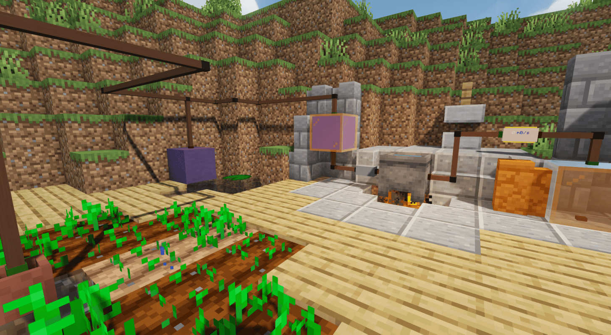 | 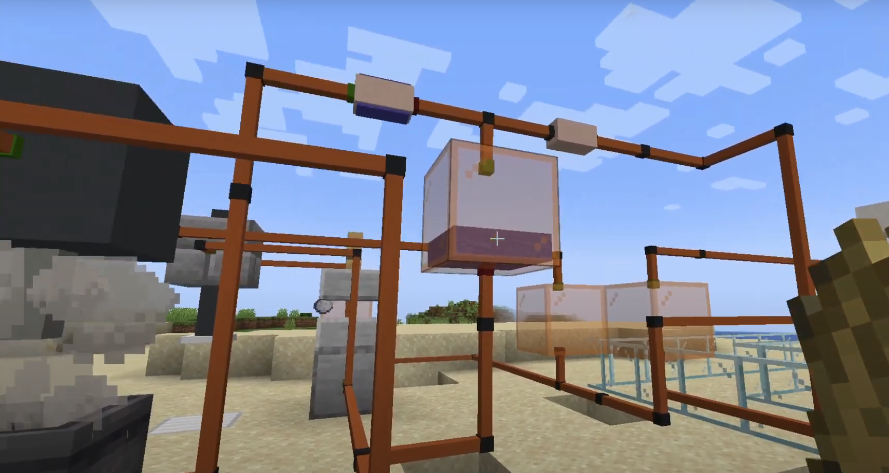 
| 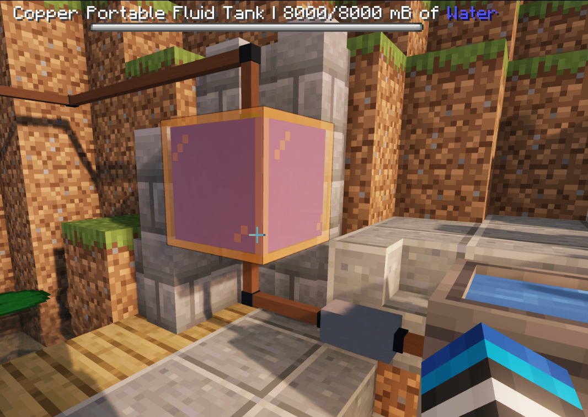 | 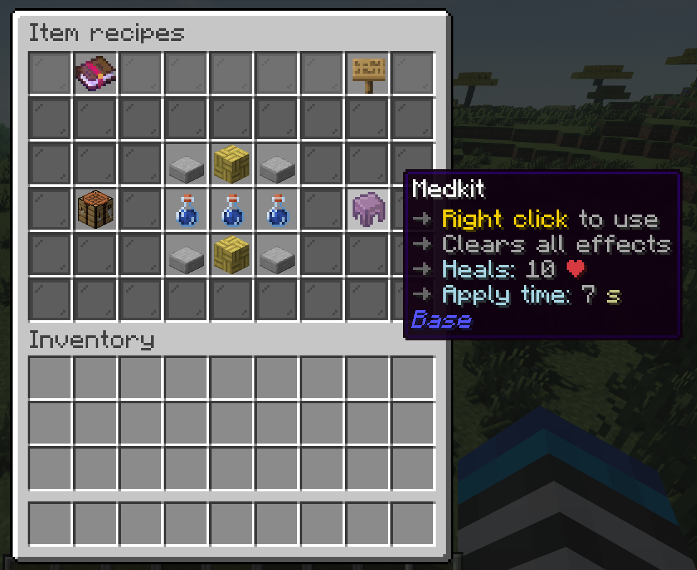 |
| 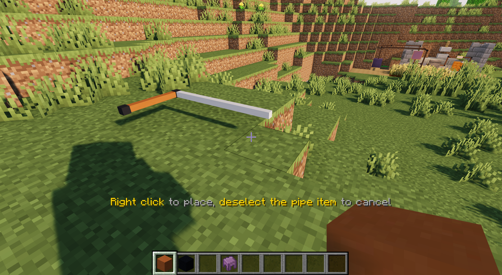 | 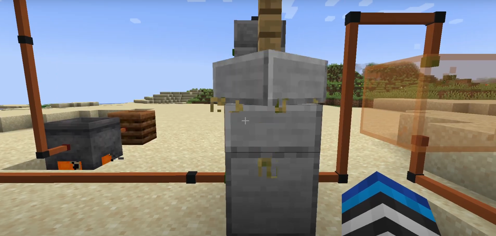 |
| 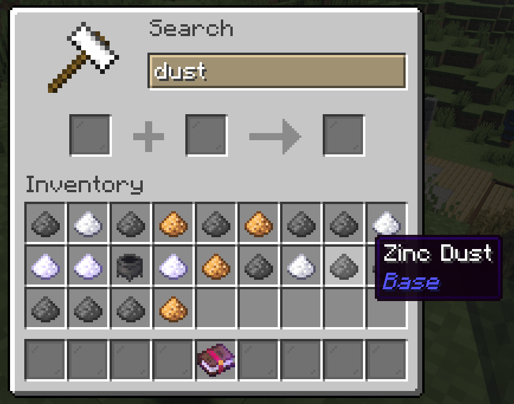 | 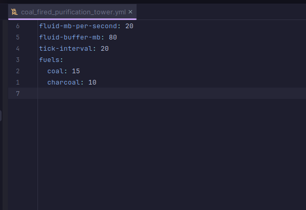 |
| 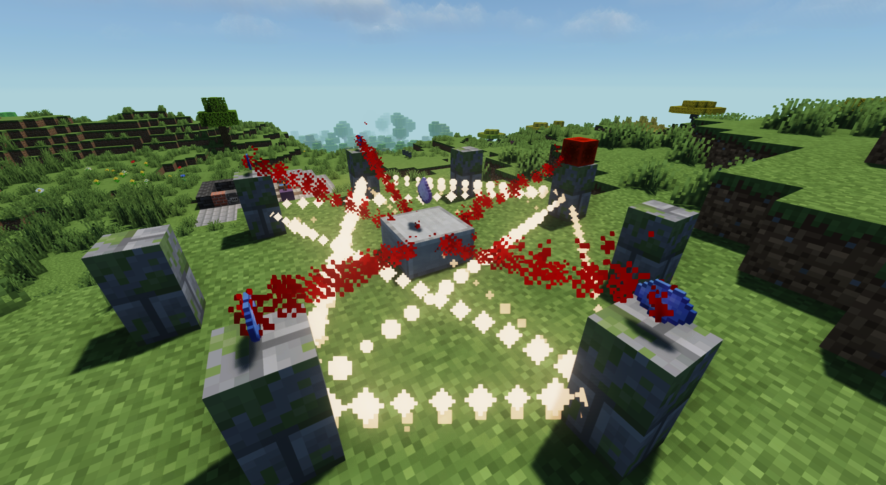 | 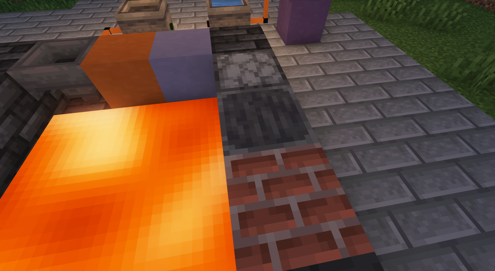 |
| 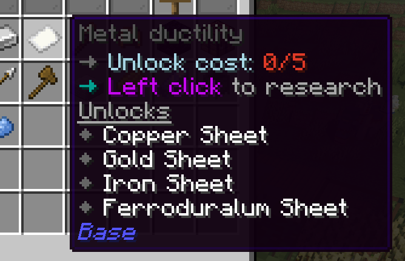 |  |

## 🕵️ 认识团队

<table>
  <thead>
    <tr>
      <th style={{width: '100px'}}>角色</th>
      <th style={{width: '120px'}}>成员</th>
      <th>简介</th>
    </tr>
  </thead>
  <tbody>
    <tr>
      <td>首席开发者</td>
      <td>🇺🇸 Seggan</td>
      <td>Slimefun 附属组件的资深开发者（SlimefunWarfare、SFCalc、Galactifun），为 Slimefun 附属、Paper 和 Slimefun 贡献了大量代码。Seggan 负责了 Rebar 与 Pylon 的许多核心系统，包括翻译、WAILA、研究、冶炼厂、配方系统等。</td>
    </tr>
    <tr>
      <td>首席开发者</td>
      <td>🇨🇦 Ohm</td>
      <td>插件开发新手，但迅速上手并出色地添加了大量基础内容，例如护符与斩首剑，以及*大量*各类小型技术调整与缺陷修复。</td>
    </tr>
    <tr>
      <td>首席开发者</td>
      <td>🇬🇧 Idra</td>
      <td>运营 Slimefun 服务器 5 年，Quaptics 开发者。他开发了许多核心系统，包括 Pylon 指南、流体系统、液压、货物、柴油、自动化测试、方块存储等。</td>
    </tr>
    <tr>
      <td>开发者</td>
      <td>🇮🇹 Vaan</td>
      <td>曾主管一个地缘政治服务器，一直在许多“细碎工作”上做出宝贵贡献——解决 issues、修复 bug、打磨优化、技术性更改等。</td>
    </tr>
    <tr>
      <td>开发者</td>
      <td>🇺🇸 Justin</td>
      <td>在 Idra 的服务器担任了 3 年首席开发者，并在 Minecraft 专业领域工作。他完成了 Pylon 纹理包支持的大部分内容，以及其他各种小优化。</td>
    </tr>
    <tr>
      <td>美术</td>
      <td>🇨🇿 Pandicka</td>
      <td>才华横溢的纹理包画师，曾为 Slimefun 纹理包工作，创作了 Pylon 资源包的绝大部分内容。</td>
    </tr>
    <tr>
      <td>贡献者</td>
      <td>🇨🇳 Balugaq</td>
      <td>前 Slimefun 附属开发者（JustEnoughGuide、SlimefunTimeIt、MSUA、AdvancedBan 等），为 Pylon/Rebar 贡献了代码（主要是配方原料计算系统），并已编写了两个扩展。</td>
    </tr>
    <tr>
      <td>贡献者</td>
      <td>🇺🇸 Blueb</td>
      <td>运营 Slimefun 服务器（Orchid）数年，添加了电梯等有趣内容。</td>
    </tr>
    <tr>
      <td>贡献者</td>
      <td>🇨🇳 Ybw0014</td>
      <td>前 Slimefun 附属开发者，曾管理 Slimefun 社区。帮助撰写了部分 Pylon/Rebar 文档。</td>
    </tr>
  </tbody>
</table>

---

## 🔧 致服务器管理员

### 性能

- ⚙️ 即使是巨大的多方块结构，相较于普通的 Rebar 方块，其性能影响也**几乎为零**。
- ⚙️ Rebar/Pylon 的大部分功能最终将异步运行。
- ⚙️ 性能已从根本上融入 Rebar/Pylon 的设计——像流体管道和货物系统从一开始就以最高效的方式构建。
- ⚙️ 您将能够限制每名玩家或每个区块每种方块的放置数量。
- ⚙️ Pylon/Rebar 将提供更多性能选项，例如降低流体管道的 tick 频率，或减少特定类型机器的 tick 频率。
- ⚙️ 我们计划添加专用的性能分析器，让您准确了解哪些方块和物品消耗的 CPU 或内存最多。

### 稳定性

- ⚙️ 轻松禁用任何有问题的方块或物品。
- ⚙️ 如果检测到配置问题，Rebar 或 Rebar 附属组件将拒绝启动。
- ⚙️ 抛出错误的方块会被安全卸载。
- ⚙️ 移除附属组件是安全的，所有数据将完好保留，如果重新添加该附属组件，数据将会恢复。
- ⚙️ Rebar 数据**直接存储在世界数据中**——无需额外备份。

### 自定义

- ⚙️ 每项研究的解锁条件与消耗均可配置。
- ⚙️ 所有配方均可配置。
- ⚙️ 大多数方块和物品都有决定其 tick 频率、速度、柴油消耗等的设置项。

---

## ⌨️ 致开发者

### 附属组件开发

- ⚙️ 您可以通过编写 Rebar 附属组件来添加内容。
- ⚙️ Rebar 支持使用 Kotlin 编写的附属组件。
- ⚙️ 添加方块、物品、配方、指南页面、流体和实体都简单直观。
- ⚙️ Rebar 将提供详尽的高层次文档，涵盖所有可用的功能。

<Callout type="warn" title="注意">
  目前由于 Pylon 仍在快速变化，暂不支持附属组件开发。
</Callout>

### 示例

查看以下代码，初步感受 Rebar 的工作方式：

<table>
  <thead>
    <tr>
      <th style={{width: '200px'}}>示例</th>
      <th>链接</th>
    </tr>
  </thead>
  <tbody>
    <tr>
      <td>便携垃圾桶</td>
      <td><a href="https://github.com/pylonmc/pylon/blob/master/src/main/java/io/github/pylonmc/pylon/content/tools/PortableDustbin.java">PortableDustbin.java</a></td>
    </tr>
    <tr>
      <td>防火符文</td>
      <td><a href="https://github.com/pylonmc/pylon/blob/master/src/main/java/io/github/pylonmc/pylon/content/tools/FireproofRune.java">FireproofRune.java</a></td>
    </tr>
    <tr>
      <td>锤子配方类型</td>
      <td><a href="https://github.com/pylonmc/pylon/blob/master/src/main/java/io/github/pylonmc/pylon/recipes/HammerRecipe.java">HammerRecipe.java</a></td>
    </tr>
    <tr>
      <td>锤子配方文件</td>
      <td><a href="https://github.com/pylonmc/pylon/blob/master/src/main/resources/recipes/pylon/hammer.yml">hammer.yml</a></td>
    </tr>
    <tr>
      <td>Pylon 英文语言文件</td>
      <td><a href="https://github.com/pylonmc/pylon/blob/master/src/main/resources/lang/en.yml">en.yml</a></td>
    </tr>
    <tr>
      <td>压榨机方块</td>
      <td><a href="https://github.com/pylonmc/pylon/blob/master/src/main/java/io/github/pylonmc/pylon/content/machines/simple/Press.java">Press.java</a></td>
    </tr>
    <tr>
      <td>液压挖掘机设置</td>
      <td><a href="https://github.com/pylonmc/pylon/blob/master/src/main/resources/settings/hydraulic_breaker.yml">hydraulic_breaker.yml</a></td>
    </tr>
  </tbody>
</table>

---

## ❓ 问与答

| 问题 | 回答                                                                                                                                                                                                                                                                                                                                                                 |
| -------- |------------------------------------------------------------------------------------------------------------------------------------------------------------------------------------------------------------------------------------------------------------------------------------------------------------------------------------------------------------------------|
| **如何安装 Pylon？** | 请阅读安装指南：[https://pylonmc.github.io/home/installing-pylon/](https://pylonmc.github.io/home/installing-pylon/)。请注意，**Pylon 和 Rebar 仍处于实验阶段，不应在可抛弃的测试服务器之外运行。**                                                                                                                                                                          |
| **Rebar 会支持 Slimefun 附属组件吗？** | 不会。从 Slimefun 迁移到 Rebar 并非易事，我们建议附属开发者完全重写其附属内容，以更好地契合 Pylon 的进度与风格，而非尝试一对一迁移。                                                                                                                                                       |
| **Rebar/Pylon 将支持哪些版本？** | 我们计划让每个 Pylon 与 Rebar 版本与发布时的最新 Minecraft 版本保持兼容。为了让我们更快更轻松地更新，**每个 Pylon/Rebar 版本将仅支持一个 Minecraft 版本。** 这意味着您需要为旧版 Minecraft 使用旧版本的 Pylon/Rebar。关键修复将会向后移植。 |
| **Pylon/Rebar 能运行在哪些服务端软件上？** | 仅限 Paper 或 Paper 分支。未来可能会支持 Folia。                                                                                                                                                                                                                                                                                                 |
| **Pylon/Rebar 会支持基岩版（通过 Geyser）吗？** | 最终会的，但这并非高优先级事项，将是最后添加的功能之一。对于此类项目，Geyser 非常难以支持，且会出现一些怪异问题。                                                                                                                                                                                           |
| **Pylon 何时能准备好？** | 请参阅上方的“暂定时间线”部分。                                                                                                                                                                                                                                                                                                                           |
| **我该如何提交翻译？** | 由于插件变化极快，我们目前不接受翻译（任何翻译都会很快过时）。当我们准备好接受翻译时会发布公告。                                                                                                                                                                    |

**如果您有其他问题，请在 [Discord](https://discord.gg/4tMAnBAacW) 上留言，我们很乐意解答。**