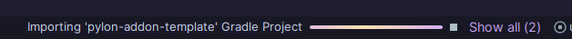
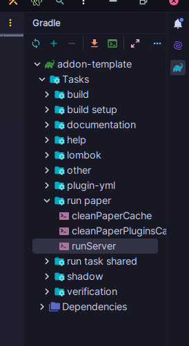

import { Callout } from 'fumadocs-ui/components/callout';

<Callout type="danger">
  目前不支持 Rebar 附属组件开发。Rebar 正在快速变化，下一个 Rebar 版本发布时，你的附属组件可能会以可怕的方式崩溃。你仍然可以制作附属组件，但要注意你可能需要做出重大更改才能保持更新。
</Callout>

## 前言

所以，你想写一个 Rebar 附属组件？好极了！我们编写这套教程是为了尽量让它简单。尽管如此，你仍需要一些基本的编程知识——如果你从未使用过 IDE 或编译器，或者从未写过 for 循环，跟随教程可能会比较困难。

在我们开始之前，先交代一些事项...

### 前置条件

我们假设：

- 你了解 Java 编程的基础知识。
- 你拥有一个 Github 账号，并能在电脑上使用 git——如果你是 git 新手，推荐使用 [Github Desktop](https://github.com/apps/desktop)。
- 你已经安装并设置了 [IntelliJ](https://www.jetbrains.com/idea/)，并且知道如何使用它。

并非必须拥有插件开发经验，但如果有的话会很有帮助！

### Rebar 与 Pylon 的区别

开始前务必理解 Rebar 和 Pylon 之间的区别。Rebar 是一个提供一系列用于创建自定义方块、实体等实用函数的库。Pylon 是一个*附属组件*，提供了一堆"基础"内容。

你的附属组件是否需要 Pylon 完全由你决定。附属组件模板默认包含 Pylon 作为依赖，但这可以轻松更改。

### 关于 Kotlin 的说明

虽然你可以纯用 Java 编写附属组件，但更有经验的 Java 程序员可能会对 [Kotlin](https://kotlinlang.org/) 感兴趣。这是一种 Java 的替代方案，使用起来更友好（尤其是在语法方面！），并且拥有 Java 所缺少的一些酷功能。Rebar 本身就是用 Kotlin 编写的。

### “我卡住了，救命！”

1. 如果有错误信息，请仔细阅读它。
2. 通过 Google 搜索问题（对于 Paper/Rebar/Pylon 开发，LLM 往往非常不可靠）。
3. 如果存在相关教程，请重新阅读一下。
4. 如果存在相关的[文档](../../documentation/overview.md)，请查看。
5. 加入 [Pylon Discord](https://discord.gg/4tMAnBAacW)，如果可能的话，**使用搜索栏**搜索与你问题相关的关键词，看看之前是否有人问过。
6. 在 Pylon Discord 上寻求帮助。

现在让我们开始吧！

---

## 环境搭建

### 复刻模板

Rebar 有一个[附属组件模板](https://github.com/pylonmc/rebar-addon-template)，你可以使用它，里面已经包含了编写 Rebar 附属组件所需的一切。[创建一个模板的复刻分支](https://www.geeksforgeeks.org/git/how-to-fork-a-github-repository/)。然后，[克隆你的复刻分支](https://www.geeksforgeeks.org/git/how-to-git-clone-a-remote-repository/)。

接下来，在 IntelliJ 中打开你的复刻分支。

IntelliJ 导入项目可能需要几分钟。

### 模板里有什么？

该模板使用 [Gradle](https://gradle.org/) 构建。项目根目录中有两个文件——`gradlew` 和 `gradlew.bat`，它们是 Gradle 包装器。如果你正在使用 IntelliJ，则无需担心它们。此外还有 `build.gradle.kts`，它向 Gradle 提供了关于如何构建你项目的指令。

`build.gradle.kts` 和 `gradle.properties` 包含了关于你项目的顶级信息——名称、版本、Rebar 版本、主类和组名。请浏览这些文件，确保你相应地更改了它们。如果你对“主类”和“组名”感到困惑，[这个链接可能会有所帮助](https://www.baeldung.com/java-packages)。

接下来是代码部分。模板中已经有一个示例方块和一个示例物品。我们还有主附属组件类 `ExampleAddon.java`。

在本教程中，我们将从头添加一个新物品来展示具体做法。

### 运行测试服务器

附属组件模板自带一个"run server"任务，你可以用它直接在 IntelliJ 中运行测试服务器。只需打开 Gradle 菜单，找到并双击 `runServer` 按钮。这将启动一个新服务器，并在你项目根目录下创建一个包含服务器的 `run` 文件夹。（如果你不在 IntelliJ 中，只需运行 `./gradlew runServer`）你可以随意修改这个服务器——添加插件、更改配置等等！

你应该会看到一个弹出控制台显示服务器输出。下载服务器可执行文件大概需要一两分钟。初次运行时它会启动失败，因为你需要同意 EULA。进入刚刚创建的 `run` 文件夹，在 `eula.txt` 中同意 EULA，然后再次运行 `runServer` 任务。

要关闭服务器，请在控制台输入 `stop` 或在游戏内使用 `/stop`。

<Callout type="danger">
  不要使用 IntelliJ 中的停止按钮来停止任务，因为这不会正常关闭服务器。那样的话你可能无法杀死服务器进程。服务器将变成不朽的。整个现实都将被吞噬。没有什么是安全的。
</Callout>

服务器启动后，你可以通过 `localhost:25565` 连接。确保你在控制台中输入 `op <用户名>` 给自己授予管理权限。

默认情况下，附属组件模板包含一个示例物品和一个示例方块。尝试使用 `/rb give <用户> exampleaddon:example_item` 来获得示例物品。
