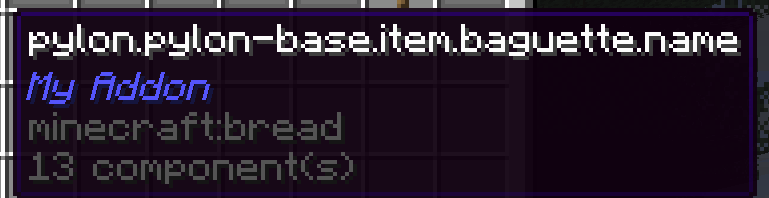
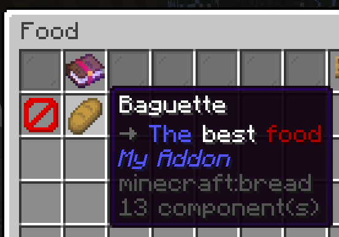

## 概览

模板附加组件只有一个类：`ExampleAddon`（或者你重命名后的名字）。该类继承了 [JavaPlugin] 并实现了 [RebarAddon]。类内部有一些注释解释了每个部分的作用——通读一遍并尝试理解它是如何工作的。现在让我们添加一个新物品！

我们先做一个法棍面包，它能补充 6 格饱食度。表面看起来可能很多内容，但不要担心！一旦你理解了，这个过程就非常简单，而且做这件事会让你接触到 Rebar 的许多核心系统。

要创建一个简单的物品，我们只需要两样东西：物品的**键 (Key)**，以及一个**物品栈 (ItemStack)**。

---

## 添加物品

### 创建键

[NamespacedKey] 是 Rebar 识别自定义物品、方块、研究、实体等的方式。

<Callout type="question" title="为什么使用 NamespacedKeys？">
  键只是一段简单的文本，比如 `pylon:copper_dust`，它让 Rebar 能够唯一标识你的物品。这和原版 Minecraft 物品有 ID 的方式非常相似。为什么我们不直接使用 `copper_dust` 作为键呢？好吧，如果两个附加组件都添加了一个叫做 `copper_dust` 的物品怎么办？我们就无法区分哪个是哪个了！为了解决这个问题，Rebar 使用 [NamespacedKey]，这意味着我们只需取一个字符串*和*你的附加组件名称，并将它们组合在一起——例如，`my_addon:copper_dust`。
</Callout>

按照惯例，键放在 `ExampleAddonKeys` 类中。创建一个新的 [NamespacedKey] 叫做 “baguette”：

```java title="ExampleAddonKeys.java"
public static final NamespacedKey baguetteKey = new NamespacedKey(ExampleAddon.getInstance(), "baguette");
```

### 创建物品栈

我们需要做的第二件事是实际的物品。我们将为此使用 [ItemStackBuilder]。

[ItemStackBuilder] 包含多种不同的方法来帮助你创建 [ItemStack]。例如，你可以使用 `.set(<组件>, <值>)` 来设置物品的一些数值，比如附魔、物品是否无法破坏等等。

**每当你在创建 Rebar 物品时，请确保使用 `ItemStackBuilder.rebar(<材料>, <键>)`。** 还有其他创建 [ItemStack] 的方法，但是**不要**使用它们来创建 Rebar 物品。

<details>
<summary>为什么使用 `ItemStackBuilder.rebar`，而不是其他创建 [ItemStack] 的方法？</summary>

在底层，Rebar 将物品键存储在 [PersistentDataContainer] (简称 PDC) 中。当你调用 `ItemStackBuilder.rebar` 并提供一个键时，该键会自动写入物品的 PDC 中。如果你提供自己的物品栈，其 PDC 将不包含该物品的键，而 Rebar 将无法将该物品与原版 Minecraft 物品区分开来。

[ItemStackBuilder] 还会将物品的名称和描述 (Lore) 设置为默认的翻译键（这将在本教程后面解释）。
</details>

按照惯例，物品放在 `ExampleAddonItems` 类中。要创建一个法棍面包，你可以这样做：

```java title="ExampleAddonItems.java"

public final class ExampleAddonItems {

    // ...

    public static final ItemStack baguette = ItemStackBuilder.rebar(Material.BREAD, baguetteKey)
            .set(DataComponentTypes.FOOD, FoodProperties.food().nutrition(6))
            .build();

    // ...
}
```

<Callout type="info" title="数据组件">
  数据组件只是一种指定物品某些信息的方法——比如“这是一个食物，可以恢复 6 点饥饿值”，或者“这是一把镐，它以 XYZ 的速度破坏方块”。你可以在[这里](https://jd.papermc.io/paper/1.21.8/io/papermc/paper/datacomponent/DataComponentTypes.html)查看完整列表。
</Callout>

### 注册物品

接下来，我们需要向 Rebar 注册我们的物品。这意味着我们需要传递两样东西：物品栈，以及应用于代表该物品的类。我们将在下一章介绍如何创建你自己的物品类，但现在你可以使用默认的 [RebarItem] 类：

```java
public final class ExampleAddonItems {

    // ...

    public static final ItemStack baguette = ItemStackBuilder.rebar(Material.BREAD, baguetteKey)
            .set(DataComponentTypes.FOOD, FoodProperties.food().nutrition(6))
            .build();

    // ...

    public static void initialize() {

        // ...

        RebarItem.register(RebarItem.class, baguette);
    }
}
```

### 将物品添加到指南中

最后，我们想将我们的物品添加到 Rebar 指南中。我们把它添加到“食物”章节里。

```java
public final class ExampleAddonItems {

    // ...

    public static final ItemStack baguette = ItemStackBuilder.rebar(Material.BREAD, baguetteKey)
            .set(DataComponentTypes.FOOD, FoodProperties.food().nutrition(6))
            .build();

    // ...

    public static void initialize() {

        // ...

        RebarItem.register(RebarItem.class, baguette);
        PylonPages.FOOD.addItem(baguetteKey);
    }
}
```

---

## 测试法棍面包

让我们测试下我们的法棍面包。启动测试服务器。现在，你可以从上一节所做的那样给自己一个法棍面包。你可以使用 `/py give` 做到这一点。例如，`/py give Idra my-addon:baguette`。如果一切正确，你应该会收到你新制作的法棍面包。

但是等等……

这是怎么回事？



要修复这个问题，我们首先需要理解**语言系统**。

---

## 使用语言系统

### 什么是语言系统？

<Callout type="info" title="如果你知道什么是语言系统，可以放心跳过此节">
</Callout>

“语言系统”这个说法，如果你以前从未用过，听起来可能令人生畏，但它其实非常直截了当。语言系统只是一种让事物可翻译的方式。

例如，假设我想创建一个奇妙的新物品，旨在让全世界的服务器管理员兴奋不已：“核弹”。我编写物品代码，然后在我的代码中，我将物品的名称设置为“核弹”。

```java
...
// (一些创建物品的代码)
...
item.setName("Nuclear Bomb")
...
```
*(不是真实代码 - 仅用于演示)*

现在，假设我们希望说西班牙语的玩家也能玩我们的组件。好吧，根据谷歌翻译，这在西班牙语里叫做“Bomba Nuclear”。但我已经在代码里写死了“Nuclear Bomb”……那么，我们如何确保西班牙玩家看到的是“Bomba Nuclear”呢？

解决方案就是使用一个通用的“翻译键”。

```java
...
// (一些创建物品的代码)
...
item.setName("item.nuclear-bomb.name")
...
```
*(不是真实代码 - 仅用于演示)*

现在，我们可以为每种语言创建一个不同的文件，包含该语言的所有翻译键！

```yaml title="en.yml"
item.nuclear-bomb.name: "Nuclear Bomb"
```
*(不是真实代码 - 仅用于演示)*

```yaml title="es.yml"
item.nuclear-bomb.name: "Bomba Nuclear"
```
*(不是真实代码 - 仅用于演示)*

显然，我们需要某种系统来为正确的人替换正确的翻译，但 Rebar 会自动为你处理这些。现在，让我们看下怎么在 Rebar 中做同样的事情。

### 使用 Rebar 的语言系统

还记得我们上面是怎么写 `item.setName("item.nuclear-bomb.name")` 的吗？在 Rebar 中，你不需要这样做，因为 Rebar 会根据你物品的键**自动生成翻译键**。我们只需要创建翻译文件，并确保它们包含正确的键。

让我们为法棍面包（上一节做的）这样做。打开位于 `src/main/resources/lang` 文件夹中的 “en.yml” 文件（“en” 是 “English” 的代码）。

<Callout type="note" title="添加其他语言的翻译">
  如果我们想创建一个西班牙语的语言文件，我们会把它叫做 “es.yml”——至于捷克语，就是 “cs.yml”，以此类推。查看[这个 Wikipedia 页面](https://minecraft.wiki/w/Language)获取这些两字母代码的完整列表。
</Callout>

接下来，在文件里添加这些内容：

```yaml title="en.yml" hl_lines="3-7"
addon: "<你的附加组件名称>"

item:
  baguette:
    name: "Baguette"
    lore: |-
      <arrow> The best food
```

注意我们有一个 `addon` 键。这仅仅是你附加组件的名称。

我们还为法棍面包添加了 `name` 和 `lore`。请注意我们在这里使用了 `baguette`，因为那是标识法棍面包的键，就像我们之前指定的那样。

再次启动服务器。你的法棍面包现在应该有名称和描述了！



---

## 添加配方

### 配方是如何工作的？

配方作为 YAML 文件存储在你附加组件的 `resources/recipes` 文件夹中。例如，在 Pylon 中，锡粒的配方存储在 `resources/recipes/minecraft/crafting_shapeless.yml` 中，看起来像这样：

```yaml title="crafting_shapeless.yml"
pylon:tin_nuggets_from_tin_ingot:
  ingredients:
    - pylon:tin_ingot
  result:
    pylon:tin_nugget: 9
```

每种配方类型都有你必须遵循的特定 YAML 结构。

<Callout type="info" title="编写配方配置">
  如果你不确定如何为特定类型的配方编写配置，请查找与该配方类型对应的 YAML 文件。例如，你可以查看 [Pylon 的 `resources/recipes` 文件夹](https://github.com/pylonmc/pylon/tree/master/src/main/resources/recipes/pylon) 以了解如何创建闪光祭坛配方。
</Callout>

### 为法棍面包创建一个配方

面团可以在普通熔炉或烟熏炉中烧制成面包。然而，对于法棍面包，我们需要更强劲的设备：高炉。

让我们创建一个在高炉中将面团烧制成法棍面包的配方。

Pylon 基础内容中已经[有一个如何编写烧制配方的示例](https://github.com/pylonmc/pylon/blob/master/src/main/resources/recipes/minecraft/blasting.yml)，所以我们去那里看看。

基于那个例子，我们来创建我们的配方。首先，创建一个文件 `resources/recipes/minecraft/blasting.yml`。然后，插入以下内容（并将 `myaddon` 更改为你的附加组件键）：

```yaml title="blasting.yml"
pylon:baguette_blasting:
  ingredient: pylon:dough
  result: myaddon:baguette
  experience: 0.5
  category: misc
```

第一行是配方的**键**。同一类型的所有配方必须具有唯一的键。除了 `category` 可能是该配方应出现在合成书中的类别外，其余的 YAML 内容基本是不言自明的。

<Callout type="info" title="寻找物品键">
  如果你不确定某个物品的键是什么，在你手中拿着它并运行 `/py key`。
</Callout>

---

## 添加研究

### 研究是如何工作的？

添加研究甚至比添加配方更容易。所有附加组件的研究都存储在 `resources/researches.yml` 中。例如，这里是“改进的钻探技术”研究：

```yaml title="researches.yml"
...
improved_drilling_techniques:
  material: iron_pickaxe
  cost: 15
  unlocks:
  - pylon:improved_manual_core_drill
  - pylon:subsurface_core_chunk
...
```

每个研究都需要一个对应的语言条目：

```yaml title="en.yml"
...
research:
  ...
  improved_drilling_techniques: "<#4f4641>Improved drilling techniques"
  ...
```

### 为法棍面包添加研究

让我们创建一个名为“法棍至上”的研究来解锁法棍面包。

首先，创建一个文件 `resources/researches.yml`。在文件中粘贴以下内容（并将 `myaddon` 更改为你附加组件的键）：

```yaml title="researches.yml"
baguette_supremacy:
  material: bread
  cost: 3
  unlocks:
  - myaddon:baguette
```

然后，在 `en.yml` 中创建一个 `researches` 部分，并按如下方式为该研究添加一个条目：

```yaml title="en.yml"
researches:
  baguette_supremacy: "<#ff0000>BAGUETTE SUPREMACY"
```

<Callout type="question" title="这个 `<#ff0000>` 是怎么回事？">
  这是 MiniMessage 标签内的[十六进制颜色代码](https://www.howtogeek.com/761277/what-is-a-hex-code-for-colors/)。你可以在[教程 3](tutorial-3.md) 部分了解更多。
</Callout>

---

## 完整代码

```java title="MyAddonKeys.java"
public final class ExampleAddonKeys {
    public static final NamespacedKey baguetteKey = new NamespacedKey(this, "baguette");
}
```

```java title="MyAddonitems.java"
public final class ExampleAddonItems {

    // ...

    public static final ItemStack baguette = ItemStackBuilder.rebar(Material.BREAD, baguetteKey)
            .set(DataComponentTypes.FOOD, FoodProperties.food().nutrition(6))
            .build();

    // ...

    public static void initialize() {

        // ...

        RebarItem.register(RebarItem.class, baguette);
        PylonPages.FOOD.addItem(baguetteKey);
    }
}
```

<span></span>

```yaml title='resources/en.yml'
addon: "<你的附加组件名称>"

item:
  baguette:
    name: Baguette
    lore: <arrow> <blue>The <white>best <dark_red>food

researches:
  baguette_supremacy: "<#ff0000>BAGUETTE SUPREMACY"
```

<span></span>

```yaml title="resources/recipes/blasting.yml"
pylon:baguette_blasting:
  ingredient: pylon:dough
  result: myaddon:baguette
  experience: 0.5
  category: misc
```

```yaml title="resources/researches.yml"
baguette_supremacy:
  material: bread
  cost: 3
  unlocks:
  - myaddon:baguette
```

[DataComponentTypes.MAX_STACK_SIZE]: https://jd.papermc.io/paper/1.21.8/io/papermc/paper/datacomponent/DataComponentTypes.html#MAX_STACK_SIZE
[DataComonentTypes.MAX_DAMAGE]: https://jd.papermc.io/paper/1.21.8/io/papermc/paper/datacomponent/DataComponentTypes.html#MAX_DAMAGE
[DataComponentTypes.DAMAGE]: https://jd.papermc.io/paper/1.21.8/io/papermc/paper/datacomponent/DataComponentTypes.html#DAMAGE
[JavaPlugin]: https://jd.papermc.io/paper/1.21.11/org/bukkit/plugin/java/JavaPlugin.html
[RebarAddon]: https://pylonmc.github.io/rebar/docs/javadoc/io/github/pylonmc/rebar/addon/RebarAddon.html
[NamespacedKey]: https://jd.papermc.io/paper/1.21.11/org/bukkit/NamespacedKey.html
[ItemStackBuilder]: https://pylonmc.github.io/rebar/docs/javadoc/io/github/pylonmc/rebar/item/builder/ItemStackBuilder.html
[ItemStack]: https://jd.papermc.io/paper/1.21.11/org/bukkit/inventory/ItemStack.html
[RebarItem]: https://pylonmc.github.io/rebar/docs/javadoc/io/github/pylonmc/rebar/item/RebarItem.html
[PersistentDataContainer]: https://jd.papermc.io/paper/1.21.11/org/bukkit/persistence/PersistentDataContainer.html
