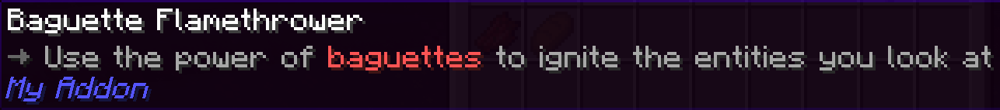
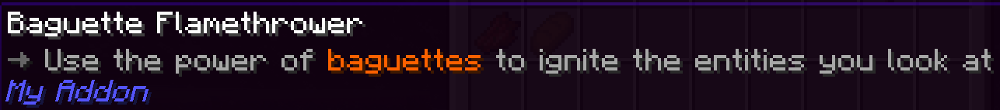
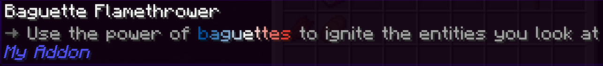
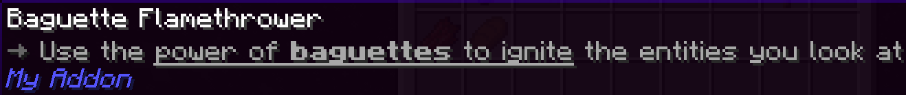

## MiniMessage

物品描述 (Lore) 可以包含诸如 `<arrow>`、`<red>` 和 `<bold>` 这样的**标签**。这些标签由 [MiniMessage](https://docs.advntr.dev/minimessage/index.html) 添加。

<Callout type="info">
  你可以在[这里](https://docs.advntr.dev/minimessage/format.html)找到 MiniMessage 标签的完整列表。
</Callout>

以下是一些你可以用 MiniMessage 实现的效果示例。

### 简单颜色

```yaml title="en.yml"
baguette_flamethrower:
  name: "Baguette Flamethrower"
  lore: |-
    <arrow> Use the power of <red>baguettes</red> to ignite the entities you look at
```



### 十六进制颜色

```yaml title="en.yml"
baguette_flamethrower:
  name: "Baguette Flamethrower"
  lore: |-
    <arrow> Use the power of <#ff6200>baguettes</#ff6200> to ignite the entities you look at
```



### 渐变

```yaml title="en.yml"
baguette_flamethrower:
  name: "Baguette Flamethrower"
  lore: |-
    <arrow> Use the power of <gradient:#0055a4:white:#ef4135>baguettes</gradient> to ignite the entities you look at
```



### 格式化

```yaml title="en.yml"
baguette_flamethrower:
  name: "Baguette Flamethrower"
  lore: |-
    <arrow> Use the <underlined>power of <bold>baguettes</bold> to ignite</underlined> the entities you look at
```



<Callout type="success" title="最佳实践">
  **避免在物品描述和名称中使用过多颜色**。理想情况下，你不应该像我们在上面的例子中那样高亮 “baguette”，因为没有实际理由这样做。

  这可能很诱人，但通常物品数量太多，很快就变成一团糟！最好在**特殊情况**下才使用颜色和格式（粗体、斜体等）。例如，放大镜 (Loupe) 将 “The examined item will be consumed” 高亮为红色，因为在使用放大镜之前了解这一点非常重要！
</Callout>

---

## Rebar 的自定义标签

乐趣不止于此——Rebar 添加了它自己的 MiniMessage 标签！你已经遇到过 Rebar 添加的 `<arrow>` 标签。Rebar 还添加了另外两个非常重要的标签：`<insn>` (指令) 和 `<attr>` (属性)。

<Callout type="info">
  你可以在[这里](../documentation/reference/language-system/tags.md)找到 Rebar 自定义标签的完整列表。
</Callout>

### 指令 (`<insn>`)

这个标签只是一个将文本以特定颜色高亮的简写。我们用它在视觉上指示一个**指令**：

```yaml title="en.yml" hl_lines="5"
baguette_flamethrower:
  name: "Baguette Flamethrower"
  lore: |-
    <arrow> Use the power of baguettes to ignite the entities you look at
    <arrow> <insn>Right click</insn> to ignite the entity you're looking at
```


### 属性 (`<attr>`)

这是另一个用于以特定颜色高亮文本的简写，这次用于**属性**：

```yaml title="en.yml" hl_lines="6"
baguette_flamethrower:
  name: "Baguette Flamethrower"
  lore: |-
    <arrow> Use the power of baguettes to ignite the entities you look at
    <arrow> <insn>Right click</insn> to ignite the entity you're looking at
    <arrow> <attr>Burn time:</attr> 2 seconds
```

<Callout type="success" title="最佳实践">
  先放描述，然后是说明，最后是属性，如上面示例所示。这有助于在 Rebar 的所有物品中保持一致性。
</Callout>


“但是等等！” 你会说，“我们不是刚刚添加了一个更改燃烧时间的设置吗？它并不总是一定是 2 秒！”

没错。而这正是**占位符**出现的地方。

---

## 占位符

有时，我们需要将代码中的值传达给物品描述，比如燃烧时间。这可以通过占位符来完成。一个占位符只是一个指标，比如 `%burn-time%`，它表示“此处将有内容被替换”。

`RebarItem` 类有一个名为 `getPlaceholders` 的方法。当实现此方法时，它会返回一个占位符列表，用于替换物品的描述。让我们为 `BaguetteFlamethrower` 实现它：

```java title="BaguetteFlamethrower.java" hl_lines="13-18"
public class BaguetteFlamethrower extends RebarItem implements RebarItemEntityInteractor {
    private final int burnTimeTicks = getSettings().getOrThrow("burn-time-ticks", ConfigAdapter.INT);

    public BaguetteFlamethrower(@NotNull ItemStack stack) {
        super(stack);
    }

    @Override
    public void onUsedToRightClickEntity(@NotNull PlayerInteractEntityEvent event, @NotNull EventPriority priority) {
        event.getRightClicked().setFireTicks(burnTimeTicks);
    }

    @Override
    public @NotNull List<RebarArgument> getPlaceholders() {
        return List.of(
                RebarArgument.of("burn-time", burnTimeTicks / 20.0)
        );
    }
}
```

现在我们可以在物品描述中使用那个占位符。占位符是你提供的字符串前后加上 %——所以在本例中是 `%burn-time%`：

```yaml title="en.yml" hl_lines="6"
baguette_flamethrower:
  name: "Baguette Flamethrower"
  lore: |-
    <arrow> Use the power of baguettes to ignite the entities you look at
    <arrow> <insn>Right click</insn> to ignite the entity you're looking at
    <arrow> <attr>Burn time:</attr> %burn-time% seconds
```


<Callout type="success" title="最佳实践">
  **始终使用占位符**，而不是将值硬编码，这样描述中的值总能保持正确。
</Callout>

### 单位

在上面的例子中，我们手动添加了 “seconds”——但 Rebar 有一个我们可以使用的单位 API。这个 API 可以自动选择如何格式化单位。使用起来非常简单：

```java title="BaguetteFlamethrower.java" hl_lines="16"
public class BaguetteFlamethrower extends RebarItem implements RebarItemEntityInteractor {
    private final int burnTimeTicks = getSettings().getOrThrow("burn-time-ticks", ConfigAdapter.INT);

    public BaguetteFlamethrower(@NotNull ItemStack stack) {
        super(stack);
    }

    @Override
    public void onUsedToRightClickEntity(@NotNull PlayerInteractEntityEvent event, @NotNull EventPriority priority) {
        event.getRightClicked().setFireTicks(burnTimeTicks);
    }

    @Override
    public @NotNull List<RebarArgument> getPlaceholders() {
        return List.of(
                RebarArgument.of("burn-time", UnitFormat.SECONDS.format(burnTimeTicks / 20.0))
        );
    }
}
```

```yaml title="en.yml" hl_lines="6"
baguette_flamethrower:
  name: "Baguette Flamethrower"
  lore: |-
    <arrow> Use the power of baguettes to ignite the entities you look at
    <arrow> <insn>Right click</insn> to ignite the entity you're looking at
    <arrow> <attr>Burn time:</attr> %burn-time%
```


<Callout type="info">
  你可以在[这里](https://pylonmc.github.io/rebar/docs/javadoc/io/github/pylonmc/rebar/util/gui/unit/UnitFormat.html)找到 Rebar 单位的完整列表。
</Callout>

<Callout type="success" title="最佳实践">
  **使用单位系统代替硬编码单位**。这意味着相同单位在所有物品中看起来一样，并且所有值都以相同的方式格式化。
</Callout>
