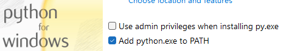
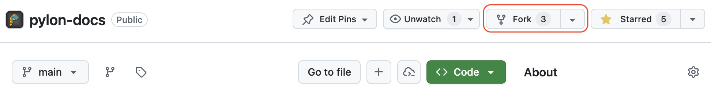
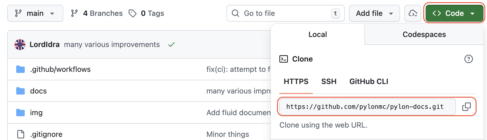
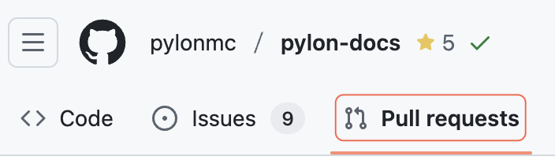

import { Callout } from 'fumadocs-ui/components/callout';

本文档站基于 [MkDocs](https://www.mkdocs.org/) 搭建，通过 [GitHub Pages](https://pages.github.com/) 发布。下面是完整的贡献流程。

## 第0步：前置条件

开始之前，请确认你的环境已经准备好以下工具：

### Git

克隆仓库和提交代码都离不开 Git。

你可以用 [Git 命令行](https://git-scm.com/install/)，也可以用 GitHub Desktop 这类图形界面工具（推荐新手使用）。

### GitHub 账号

Fork 仓库和创建 PR 都需要 GitHub 账号。

还没有的话可以[免费注册一个](https://github.com/signup)。

### Python 和 pip

MkDocs 需要较新版本的 [Python](https://www.python.org/) 和包管理器 [pip](https://pip.pypa.io/en/stable/installation/)。

在终端里检查一下是否已安装（版本号可能不同）：

```bash
$ python3 --version
Python 3.13.3
$ pip3 --version
pip 25.2
```

没装的话去[官方下载页](https://www.python.org/downloads/)安装即可。

<Callout>
  **Windows 用户注意**
  安装时如果看到 "Add Python to PATH" 选项，记得勾上（默认是不勾的）。

  
</Callout>

---

## 第1步：Fork 仓库

打开[文档仓库](https://github.com/pylonmc/docs)，点击右上角的 **Fork** 按钮，创建你自己的副本。



---

## 第2步：克隆你的 fork

把 fork 到手上的仓库克隆到本地，才能预览和编辑。

用 GitHub Desktop 的话，参考[官方指南](https://docs.github.com/en/desktop/adding-and-cloning-repositories/cloning-a-repository-from-github-to-github-desktop)操作即可。

用命令行的话，去你的 fork 页面点绿色的 **Code** 按钮，复制 HTTPS 地址：



然后运行：

```bash
git clone <REPLACE_URL_HERE>
```

---

## 第3步：安装依赖

仓库到手了，接下来安装依赖包。

在 `docs` 目录下执行：

```bash
pip install -r requirements.txt
```

这会安装 MkDocs 及其他所有必需的包。

---

## 第4步：开始修改

现在可以编辑文档了！

<Callout type="warn">
  你在 fork 上的所有修改不会影响官方文档，必须通过 PR 合入才会生效。
</Callout>

文档用 Markdown 编写。语法不熟的话可以看 [Mastering Markdown](https://guides.github.com/features/mastering-markdown/)，或者直接参考[本页的 Markdown 源码](https://github.com/pylonmc/docs/blob/main/docs/en/documentation/contributing/contributing-to-docs.md?plain=1)。

### 4.1 了解目录结构

文档按语言分目录存放在 `docs/` 下：

```text
docs/
├── en/          # 英文文档
├── zh-CN/       # 简体中文文档
└── ...          # 其他语言
```

英文文档都在 `docs/en/` 下，按章节和子目录组织。

<Callout type="error">
  **重要**
  目前我们只接受英文文档的贡献——Rebar 和 Pylon 还在频繁变动中。其他语言的贡献请关注后续通知。
</Callout>

每个章节都有独立的目录，该章节用到的图片放在同目录下的 `img/` 文件夹中。

### 4.2 创建新页面

打开 `docs` 目录，按以下步骤操作：

1. 进入 `docs/en/` 下对应的子目录（比如 `docs/en/installation/`）
2. 新建一个 `.md` 文件，取个有意义的名字

**命名规则：**

- 文件名以 `.md` 结尾
- 全部小写
- 用连字符 `-` 代替空格
- 不用特殊字符
- 示例：`installing-addons.md`、`custom-recipes.md`、`getting-started.md`

然后：

1. 用 [Markdown 语法](https://guides.github.com/features/mastering-markdown/)写内容
2. 保存文件
3. 预览效果（见[第5步](#step-5-previewing-your-changes)）

### 4.3 编辑现有页面

1. 用编辑器打开要改的文件
2. 改内容
3. 保存
4. 预览（见[第5步](#step-5-previewing-your-changes)）

### 4.4 添加图片

#### 命名规范

- 全部小写
- 用连字符 `-` 代替空格
- 取个描述性的名字
- 优先用 PNG 格式
- 示例：`github-fork.png`、`custom-item-example.png`、`crafting-table.png`

#### 存放位置

图片放在 markdown 文件**同一级目录**下的 `img/` 文件夹中。

例如页面路径是 `docs/en/installation/installing-pylon.md`，那图片就放 `docs/en/installation/img/` 下。

没有 `img/` 文件夹的话先新建一个。

#### 在页面中引用

```markdown

```

**示例：**

```markdown

```

---

## 第5步：预览效果

提交之前建议先在本地预览一下，确认显示正常。

在 `docs` 目录下运行：

```bash
mkdocs serve --livereload
```

这会启动一个本地服务器。浏览器打开 [`http://127.0.0.1:8000`](http://127.0.0.1:8000) 就能看到带了你修改的文档站点。

保存文件后页面会自动刷新。

---

## 第6步：提交并推送

改好了就可以提交并推送到你的 fork 了。

用 GitHub Desktop 的话，参考[官方指南](https://docs.github.com/en/desktop/making-changes-in-a-branch/committing-and-reviewing-changes-to-your-project-in-github-desktop)操作。

用命令行的话，在 `docs` 目录下执行：

```bash
git add .
git commit -m "描述你改了什么的提交信息"
git push
```

<Callout type="tip">
  提交信息尽量写得清楚一些，说明改了什么、为什么这样改。
</Callout>

---

## 第7步：创建 PR

推送到 GitHub 之后，就可以开 PR 提交你的修改了。

1. 打开你在 GitHub 上的 fork 仓库（在 GitHub 首页或个人主页都能找到）
2. 点 **Pull requests** 标签页
   
3. 点绿色的 **New pull request** 按钮
4. 填好标题和描述
5. 点 **Create pull request**

搞定！之后维护者会审查你的改动。没问题的话就会被合并。

---

## 第8步：更新 PR

PR 提交之后如果还需要改（比如 reviewer 提了修改意见），操作很简单：

重复[第4步](#step-4-making-your-changes)到[第6步](#step-6-committing-and-pushing-your-changes)就行，PR 会自动同步你的新改动，直到被合并或关闭。

---

**感谢你对文档的贡献！**
