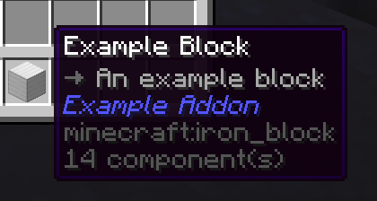
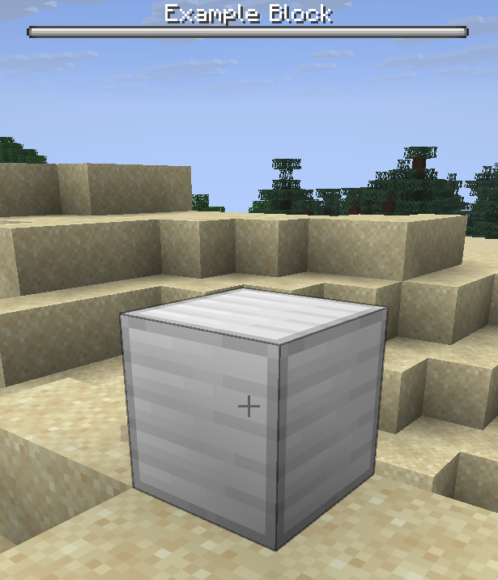

import { Callout } from 'fumadocs-ui/components/callout';

# 自定义方块

<Callout type="warn">
  **本文档假设您了解 Rebar 物品的基础知识。**
</Callout>

添加自定义方块需要 3 样东西：

- 一个方块类
- 标识您方块的 `NamespacedKey`
- 对应的 `RebarItem`（不是严格必需，但建议让玩家可以放置您的方块）

## 方块类

在 Rebar 中，每种方块都有对应的类，这个类的实例就代表世界里的那个方块。比如每个已加载的水泵，背后都有一个 `WaterPump` 实例。

每个方块类需要两个构造函数：'place' 构造函数（在放置方块时调用）和 'load' 构造函数（在加载方块时调用）。

下面是一个最简的方块类示例，什么额外功能都不实现：

```java title="ExampleBlock.java"
public class ExampleBlock extends RebarBlock implements RebarInteractBlock {

    // 'Place' 构造函数 - 在方块放下时调用
    public ExampleBlock(@NonNull Block block, @NonNull BlockCreateContext context) {
        super(block, context);
    }

    // 'Load' 构造函数 - 在方块加载时调用
    public ExampleBlock(@NonNull Block block, @NonNull PersistentDataContainer pdc) {
        super(block, pdc);
    }
}
```


## 注册方块

注册方块本身很简单。先创建一个 key：
```java title="ExampleAddonKeys.java"
public class ExampleAddonKeys {
    public static final NamespacedKey EXAMPLE_BLOCK = new NamespacedKey(ExampleAddon.getInstance(), "example_block");
}
```

接下来，我们可以注册方块：
```java
RebarBlock.register(ExampleAddonKeys.EXAMPLE_BLOCK, Material.IRON_BLOCK, ExampleBlock.class);
```

<Callout type="info">
  **应该从您附属组件的 `onEnable` 方法中注册方块。**
  建议单独建一个文件统一处理所有方块的注册，免得 `onEnable` 函数太臃肿。
</Callout>

注册方块不会自动注册对应的物品。我们还需要单独注册一个物品，这样玩家才能在物品栏里拿到这个方块。通常物品和方块共用同一个 key。因为我们的物品不需要什么特殊行为，直接用 `RebarItem` 就行：
```java title="ExampleAddonItems.java"
public static final ItemStack EXAMPLE_BLOCK = ItemStackBuilder.rebar(Material.IRON_BLOCK, ExampleAddonKeys.EXAMPLE_BLOCK)
        .build();
```

```java
// 注册一个代表 Example Block 的"普通"物品
// 方块和它们对应的物品几乎总是共享相同的 key
// 注意第3个参数 - 这是 [ExampleAddonBlocks] 中注册的对应方块的 key
RebarItem.register(RebarItem.class, EXAMPLE_BLOCK, ExampleAddonKeys.EXAMPLE_BLOCK);
PylonPages.MISCELLANEOUS.addItem(EXAMPLE_BLOCK);
```

我们还需要物品的语言文件条目：
```yaml title="en.yml"
item:
  example_block:
    name: "Example Block"
    lore: |-
      <arrow> An example block
```

以上就是添加一个简单自定义方块所需的全部步骤。


