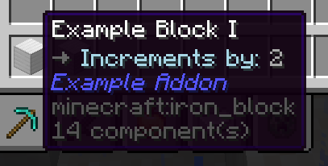
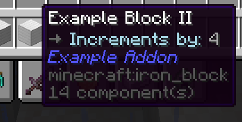

import { Callout } from 'fumadocs-ui/components/callout';

# 设置

与物品一样，您可以为方块分配设置。

假设我们有一个每次右键点击时计数器加一的方块：

```java title="ExampleAddonKeys.java"
public class ExampleAddonKeys {
    public static final NamespacedKey EXAMPLE_BLOCK = new NamespacedKey(ExampleAddon.getInstance(), "example_block");
}
```

```java title="ExampleBlock.java"
public class ExampleBlock extends RebarBlock implements RebarInteractBlock {

    public static final NamespacedKey COUNTER_KEY = new NamespacedKey(ExampleAddon.getInstance(), "counter");

    private int counter = 0;

    public ExampleBlock(@NotNull Block block, @NotNull BlockCreateContext context) {
        super(block, context);
    }

    public ExampleBlock(@NotNull Block block, @NotNull PersistentDataContainer pdc) {
        super(block, pdc);
        counter = pdc.get(COUNTER_KEY, RebarSerializers.INTEGER);
    }

    @Override
    public void write(@NonNull PersistentDataContainer pdc) {
        pdc.set(COUNTER_KEY, RebarSerializers.INTEGER, counter);
    }

    @Override
    public void onInteract(@NotNull PlayerInteractEvent event, @NotNull EventPriority priority) {
        if (event.getAction().isRightClick() && event.getHand() == EquipmentSlot.HAND) {
            counter++;
            event.getPlayer().sendMessage(String.valueOf(counter));
        }
    }
}
```

```java title="ExampleAddonBlocks.java"
public final class ExampleAddonBlocks {
    public static void initialize() {
        RebarBlock.register(ExampleAddonKeys.EXAMPLE_BLOCK, Material.IRON_BLOCK, ExampleBlock.class);
    }
}
```

```java title="ExampleAddonItems.java"
public final class ExampleAddonItems {

    public static final ItemStack EXAMPLE_BLOCK = ItemStackBuilder.rebar(Material.IRON_BLOCK, ExampleAddonKeys.EXAMPLE_BLOCK)
            .build();

    public static void initialize() {
        RebarItem.register(RebarItem.class, EXAMPLE_BLOCK, ExampleAddonKeys.EXAMPLE_BLOCK);
        PylonPages.MISCELLANEOUS.addItem(EXAMPLE_BLOCK);
    }
}
```

```java title="en.yml"
item:
  example_block:
    name: "Example Block"
    lore: |-
      <arrow> An example block
```

假设您希望将计数器更改为可配置的量，而不是总是按 1 增加。首先，创建一个文件 `resources/settings/example_block.yml`（文件名必须是您想要更改的方块的 key）：
```yaml title="example_block.yml"
increment-by: 4
```

您可以使用 `getSettings()` 获取配置值：
```java title="ExampleBlock.java"
public class ExampleBlock extends RebarBlock implements RebarInteractBlock {


    // ...

    public final int incrementBy = getSettings().getOrThrow("increment-by", ConfigAdapter.INTEGER);

    // ...
}
```

现在，您可以将计数器更改为配置值，而不是按 1 增加：
```java title="ExampleBlock.java"
public class ExampleBlock extends RebarBlock implements RebarInteractBlock {


    // ...

    @Override
    public void onInteract(@NotNull PlayerInteractEvent event, @NotNull EventPriority priority) {
        if (event.getAction().isRightClick() && event.getHand() == EquipmentSlot.HAND) {
            counter += incrementBy;
            event.getPlayer().sendMessage(String.valueOf(counter));
        }
    }
}
```

该块现在将按 4 的增量计数。

## 一个类，多个方块

假设您想要有两种不同类型的计数器：一种每次计数增加 2，另一种每次增加 4。您不需要为此创建新的类。相反，您可以注册两个使用相同类的不同计数器块：
```java title="ExampleAddonKeys.java"
public class ExampleAddonKeys {
    public static final NamespacedKey EXAMPLE_BLOCK_1 = new NamespacedKey(ExampleAddon.getInstance(), "example_block_1");
    public static final NamespacedKey EXAMPLE_BLOCK_2 = new NamespacedKey(ExampleAddon.getInstance(), "example_block_2");
}
```

```java title="ExampleAddonBlocks.java"
public final class ExampleAddonBlocks {
    public static void initialize() {
        RebarBlock.register(ExampleAddonKeys.EXAMPLE_BLOCK_1, Material.IRON_BLOCK, ExampleBlock.class);
        RebarBlock.register(ExampleAddonKeys.EXAMPLE_BLOCK_2, Material.IRON_BLOCK, ExampleBlock.class);
    }
}
```

```java title="ExampleAddonItems.java"
public final class ExampleAddonItems {

    public static final ItemStack EXAMPLE_BLOCK_1 = ItemStackBuilder.rebar(Material.IRON_BLOCK, ExampleAddonKeys.EXAMPLE_BLOCK_1)
            .build();

    public static final ItemStack EXAMPLE_BLOCK_2 = ItemStackBuilder.rebar(Material.IRON_BLOCK, ExampleAddonKeys.EXAMPLE_BLOCK_2)
            .build();

    public static void initialize() {
        RebarItem.register(RebarItem.class, EXAMPLE_BLOCK_1, ExampleAddonKeys.EXAMPLE_BLOCK_1);
        PylonPages.MISCELLANEOUS.addItem(EXAMPLE_BLOCK_1);

        RebarItem.register(RebarItem.class, EXAMPLE_BLOCK_2, ExampleAddonKeys.EXAMPLE_BLOCK_2);
        PylonPages.MISCELLANEOUS.addItem(EXAMPLE_BLOCK_2);
    }
}
```

```java title="en.yml"
item:
  example_block_1:
    name: "Example Block I"
    lore: |-
      <arrow> An example block

  example_block_2:
    name: "Example Block II"
    lore: |-
      <arrow> An example block
```

每个块都可以有自己的设置：
```yaml title="example_block_1.yml"
increment-by: 2
```

```yaml title="example_block_2.yml"
increment-by: 4
```

现在，您有两个块：一个每次计数增加 2，另一个每次增加 4。

## 方块和物品共享设置

设置由 `NamespacedKey` 引用。在底层，`getSettings()` 只是 `Settings.get(getKey())` 的简写。由于在这种情况下物品与块具有相同的 keys，在物品类中调用 `getSettings()` 返回相同的设置。

为了演示这一点，假设我们想要向 Example Block 物品的 lore 中添加一个值，显示计数器增加了多少。我们可以将值硬编码到语言文件中：
```java title="en.yml"
item:
  example_block_1:
    name: "Example Block I"
    lore: |-
      <arrow> <attr>Increments by:</attr> 2

  example_block_2:
    name: "Example Block II"
    lore: |-
      <arrow> <attr>Increments by:</attr> 4
```

但是，如果配置值发生更改，此更改将不会反映在物品的 lore 中。因此，我们将提供一个占位符：
```java title="en.yml"
item:
  example_block_1:
    name: "Example Block I"
    lore: |-
      <arrow> <attr>Increments by:</attr> %increment-by%

  example_block_2:
    name: "Example Block II"
    lore: |-
      <arrow> <attr>Increments by:</attr> %increment-by%
```

为了提供占位符，我们需要创建一个新类来扩展 `RebarItem` 并覆盖 `getPlaceholders()`。然后我们将可配置的 `incrementBy` 值作为 `%increment-by%` 提供：
```java title="ExampleBlockItem.java"
public class ExampleBlockItem extends RebarItem {

    public final int incrementBy = getSettings().getOrThrow("increment-by", ConfigAdapter.INTEGER);

    public ExampleBlockItem(@NonNull ItemStack stack) {
        super(stack);
    }

    @Override
    public @NonNull List<RebarArgument> getPlaceholders() {
        return List.of(
            RebarArgument.of("increment-by", incrementBy)
        );
    }
}
```

<Callout type="warn">
  **我真的需要在物品和方块中都获取 incrementBy 的值两次吗 - 一次在物品中，一次在方块中？**
  不幸的是，是的。过去曾热烈讨论过绕过这个问题的其他方法，但这是最不糟糕的折衷方案。其他选项涉及更复杂的代码和更少的灵活性。
</Callout>

我们现在可以使用此类注册物品：
```java title="ExampleAddonItems.java"
public final class ExampleAddonItems {

    public static final ItemStack EXAMPLE_BLOCK_1 = ItemStackBuilder.rebar(Material.IRON_BLOCK, ExampleAddonKeys.EXAMPLE_BLOCK_1)
            .build();

    public static final ItemStack EXAMPLE_BLOCK_2 = ItemStackBuilder.rebar(Material.IRON_BLOCK, ExampleAddonKeys.EXAMPLE_BLOCK_2)
            .build();

    public static void initialize() {
        RebarItem.register(ExampleBlockItem.class, EXAMPLE_BLOCK_1, ExampleAddonKeys.EXAMPLE_BLOCK_1);
        PylonPages.MISCELLANEOUS.addItem(EXAMPLE_BLOCK_1);

        RebarItem.register(ExampleBlockItem.class, EXAMPLE_BLOCK_2, ExampleAddonKeys.EXAMPLE_BLOCK_2);
        PylonPages.MISCELLANEOUS.addItem(EXAMPLE_BLOCK_2);
    }
}
```

这将在物品的 lore 中显示块递增计数的量：


