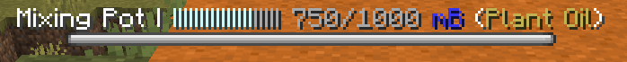
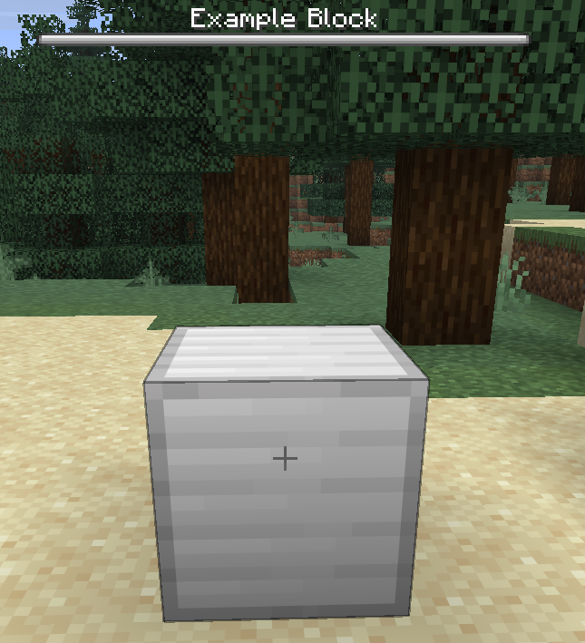
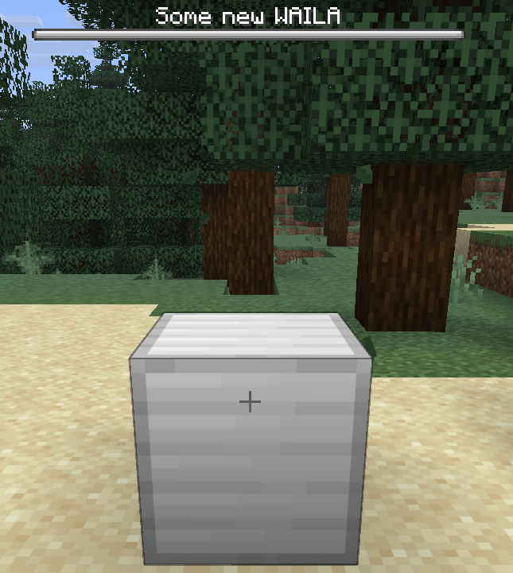
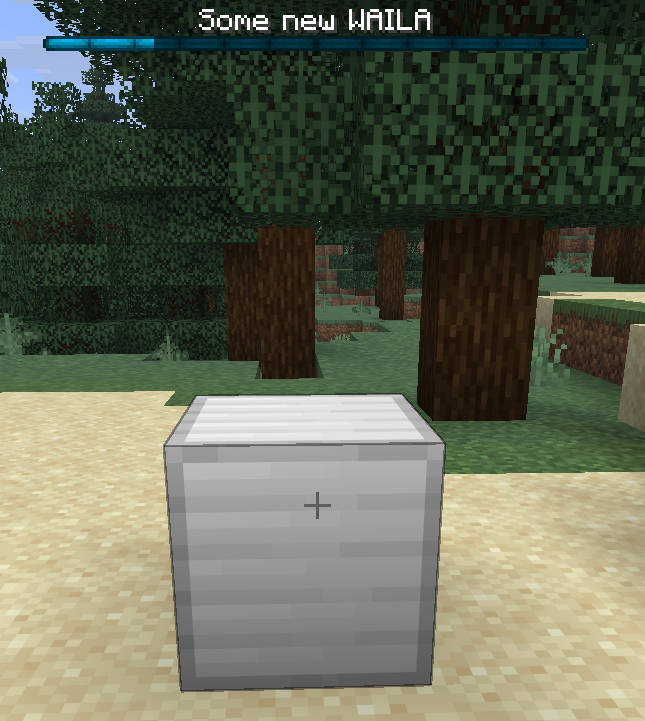
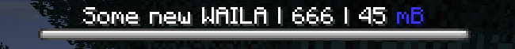

# WAILA

WAILA（What Am I Looking At）显示您正在查看的 Rebar 方块的信息：



默认情况下，方块将在 WAILA 中简单地显示其名称：




## 设置自定义 WAILA 文本

您可以通过在 `en.yml` 中添加 `waila` key 来设置 WAILA 文本：

```yaml title="en.yml"
item:
  example_block:
    name: "Example Block"
    lore: |-
      <arrow> An example block
    waila: "Some new WAILA"
```




## 覆盖 `getWaila`

您可以覆盖 `getWaila` 来更改方块的 WAILA 的所有方面：
```java title="ExampleBlock.java"
public class ExampleBlock extends RebarBlock {

    ...

    @Override
    public @Nullable WailaDisplay getWaila(@NotNull Player player) {
        return new WailaDisplay(
                getDefaultWailaTranslationKey(), // 文本（使用默认文本 - 相当于根本不覆盖 `getWaila`）
                BossBar.Color.BLUE, // 颜色
                BossBar.Overlay.NOTCHED_12, // 样式
                0.2F // 进度
        );
    }
}
```




## 占位符

与物品一样，您可以为 WAILA 文本提供 `RebarArgument` 形式的占位符：

```java title="ExampleBlock.java"
public class ExampleBlock extends RebarBlock {

    ...

    @Override
    public @Nullable WailaDisplay getWaila(@NotNull Player player) {
        return new WailaDisplay(
                getDefaultWailaTranslationKey().arguments(
                        RebarArgument.of("something", 666),
                        RebarArgument.of("another-thing", UnitFormat.MILLIBUCKETS.format(45))
                )
        );
    }
}
```

```yaml title="en.yml"
item:
  example_block:
    name: "Example Block"
    lore: |-
      <arrow> An example block
    waila: "Some new WAILA | %something% | %another-thing%"
```

