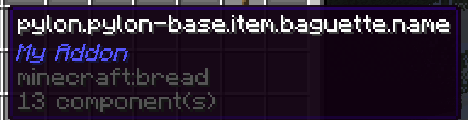
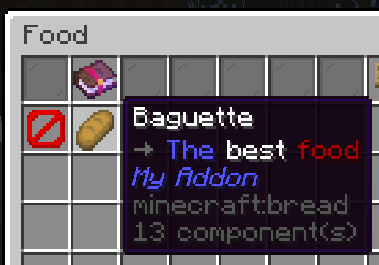

## 概览

模板附属只有一个类：`ExampleAddon`（或者你改过的名字）。该类继承了 [JavaPlugin] 并实现了 [RebarAddon]。类里有注释解释每个部分的作用——通读一遍，搞懂它是怎么工作的。现在来加一个新物品！

先做一个法棍面包，能回复 6 点饥饿值。看起来步骤不少，别担心！一旦理解了流程就很简单，而且这个过程会让你接触到 Rebar 的许多核心系统。

要创建一个简单的物品，我们只需要两样东西：物品的**键 (Key)**，以及一个**物品栈 (ItemStack)**。

---

## 添加物品

### 创建键

[NamespacedKey] 是 Rebar 识别自定义物品、方块、研究、实体等的方式。

<Callout type="question" title="为什么使用 NamespacedKeys？">
  键就是一段文本，比如 `pylon:copper_dust`，让 Rebar 能唯一标识你的物品。这和原版 Minecraft 物品有 ID 的方式很像。为什么不直接用 `copper_dust` 做键呢？如果两个附属都加了一个叫 `copper_dust` 的物品，就分不清谁是谁了！所以 Rebar 用 [NamespacedKey]，把字符串和你的附属名称组合在一起——比如 `my_addon:copper_dust`。
</Callout>

按照惯例，键放在 `ExampleAddonKeys` 类中。创建一个新的 [NamespacedKey] 叫做 "baguette"：

```java title="ExampleAddonKeys.java"
public static final NamespacedKey baguetteKey = new NamespacedKey(ExampleAddon.getInstance(), "baguette");
```

### 创建物品栈

接下来要做的是创建实际的物品。我们用 [ItemStackBuilder] 来完成。

[ItemStackBuilder] 提供了各种方法帮你创建 [ItemStack]。比如用 `.set(<组件>, <值>)` 设置附魔、物品是否不可破坏等属性。

**每当你在创建 Rebar 物品时，请确保使用 `ItemStackBuilder.rebar(<材料>, <键>)`。** 还有其他创建 [ItemStack] 的方法，但是**不要**使用它们来创建 Rebar 物品。

<details>
<summary>为什么使用 `ItemStackBuilder.rebar`，而不是其他创建 [ItemStack] 的方法？</summary>

在底层，Rebar 把物品键存在 [PersistentDataContainer]（简称 PDC）里。调用 `ItemStackBuilder.rebar` 并传入键时，键会自动写入物品的 PDC。如果你自己提供物品栈，PDC 里不会有这个键，Rebar 就没法把它和原版物品区分开。

[ItemStackBuilder] 还会把物品名称和描述（Lore）设成默认翻译键（后面会解释）。
</details>

按照惯例，物品放在 `ExampleAddonItems` 类中。创建法棍面包：

```java title="ExampleAddonItems.java"

public final class ExampleAddonItems {

    // ...

    public static final ItemStack baguette = ItemStackBuilder.rebar(Material.BREAD, baguetteKey)
            .set(DataComponentTypes.FOOD, FoodProperties.food().nutrition(6))
            .build();

    // ...
}
```

<Callout type="info" title="数据组件">
  数据组件就是用来指定物品某些信息的方式——比如"这是一个食物，回复 6 点饥饿值"，或者"这是一把镐，以 XYZ 的速度挖方块"。完整列表在[这里](https://jd.papermc.io/paper/1.21.8/io/papermc/paper/datacomponent/DataComponentTypes.html)。
</Callout>

### 注册物品

接下来，需要向 Rebar 注册物品。这里要传两个东西：物品栈，以及代表该物品的类。下一章会教你怎么创建自己的物品类，现在先用默认的 [RebarItem] 类：

```java
public final class ExampleAddonItems {

    // ...

    public static final ItemStack baguette = ItemStackBuilder.rebar(Material.BREAD, baguetteKey)
            .set(DataComponentTypes.FOOD, FoodProperties.food().nutrition(6))
            .build();

    // ...

    public static void initialize() {

        // ...

        RebarItem.register(RebarItem.class, baguette);
    }
}
```

### 将物品添加到指南中

最后，把物品加到 Rebar 指南里。我们把它加到"食物"章节：

```java
public final class ExampleAddonItems {

    // ...

    public static final ItemStack baguette = ItemStackBuilder.rebar(Material.BREAD, baguetteKey)
            .set(DataComponentTypes.FOOD, FoodProperties.food().nutrition(6))
            .build();

    // ...

    public static void initialize() {

        // ...

        RebarItem.register(RebarItem.class, baguette);
        PylonPages.FOOD.addItem(baguetteKey);
    }
}
```

---

## 测试法棍面包

测试一下法棍面包。启动测试服务器，像上一节那样给自己一个法棍面包。用 `/py give` 就行，比如 `/py give Idra my-addon:baguette`。如果一切正常，你应该能拿到新做的法棍面包。

但是等等……

这是怎么回事？



要解决这个问题，得先了解**语言系统**。

---

## 使用语言系统

### 什么是语言系统？

<Callout type="info">
如果你知道什么是语言系统，可以放心跳过此节
</Callout>

"语言系统"这个说法，如果你以前没接触过，听着可能吓人，但其实很简单。语言系统就是让内容可翻译的一套方案。

举个例子，假设我想做一个让全世界服主都兴奋的新物品："核弹"。写好物品代码后，我在代码里把名称设成 "Nuclear Bomb"。

```java
...
// (一些创建物品的代码)
...
item.setName("Nuclear Bomb")
...
```
*(不是真实代码 - 仅用于演示)*

现在，假设我们想让西班牙语玩家也能用我们的附属。根据谷歌翻译，西班牙语叫 "Bomba Nuclear"。但代码里已经写死了 "Nuclear Bomb"……怎么让西班牙玩家看到 "Bomba Nuclear" 呢？

办法是用通用的"翻译键"。

```java
...
// (一些创建物品的代码)
...
item.setName("item.nuclear-bomb.name")
...
```
*(不是真实代码 - 仅用于演示)*

现在可以给每种语言建不同的文件，存放对应的翻译键：

```yaml title="en.yml"
item.nuclear-bomb.name: "Nuclear Bomb"
```
*(不是真实代码 - 仅用于演示)*

```yaml title="es.yml"
item.nuclear-bomb.name: "Bomba Nuclear"
```
*(不是真实代码 - 仅用于演示)*

当然，需要一套机制来给不同的人显示不同的翻译——不过 Rebar 会自动处理这些。来看看在 Rebar 里怎么做。

### 使用 Rebar 的语言系统

还记得上面写的 `item.setName("item.nuclear-bomb.name")` 吗？在 Rebar 里你不需要这么做，因为 Rebar 会根据物品的键**自动生成翻译键**。我们只要建好翻译文件，确保里面包含正确的键就行。

给法棍面包（上一节做的那个）加上翻译。打开 `src/main/resources/lang` 目录下的 `en.yml` 文件（"en" 就是 "English" 的代码）。

<Callout type="note" title="添加其他语言的翻译">
  想加西班牙语的话，文件名叫 `es.yml`；捷克语就是 `cs.yml`，以此类推。完整的三字母代码列表看[这个 Wikipedia 页面](https://minecraft.wiki/w/Language)。
</Callout>

在文件里加上这些内容：

```yaml title="en.yml" hl_lines="3-7"
addon: "<你的附属组件名称>"

item:
  baguette:
    name: "Baguette"
    lore: |-
      <arrow> The best food
```

注意有个 `addon` 键，这里填你附属的名称。

还给法棍面包加了 `name` 和 `lore`。注意这里用的是 `baguette`，因为这就是标识法棍面包的键（前面定义的那个）。

重启服务器。你的法棍面包现在应该有名称和描述了！



---

## 添加配方

### 配方怎么运作？

配方以 YAML 文件形式放在附属的 `resources/recipes` 目录下。比如 Pylon 里，锡粒的配方在 `resources/recipes/minecraft/crafting_shapeless.yml`：

```yaml title="crafting_shapeless.yml"
pylon:tin_nuggets_from_tin_ingot:
  ingredients:
    - pylon:tin_ingot
  result:
    pylon:tin_nugget: 9
```

每种配方类型都有固定的 YAML 格式。

<Callout type="info" title="编写配方配置">
  不确定某种配方该怎么写？去找对应类型的 YAML 文件参考一下。比如看 [Pylon 的 `resources/recipes` 目录](https://github.com/pylonmc/pylon/tree/master/src/main/resources/recipes/pylon) 了解闪光祭坛配方的写法。
</Callout>

### 给法棍面包写个配方

面团可以在普通熔炉或烟熏炉里烤成面包。但做法棍得用更猛的设备：高炉。

我们来写一个高炉烧制配方，把面团烤成法棍面包。

Pylon 基础内容里已经有[烧制配方的示例](https://github.com/pylonmc/pylon/blob/master/src/main/resources/recipes/minecraft/blasting.yml)了，去看看。

参照那个例子来写。先建一个 `resources/recipes/minecraft/blasting.yml` 文件，然后写入以下内容（把 `myaddon` 改成你的附属键）：

```yaml title="blasting.yml"
pylon:baguette_blasting:
  ingredient: pylon:dough
  result: myaddon:baguette
  experience: 0.5
  category: misc
```

第一行是配方的**键名**。同类型的每个配方必须有唯一的键。除了 `category` 是合成书里的分类之外，其他 YAML 内容基本一看就懂。

<Callout type="info" title="寻找物品键">
  不确定某个物品的键是什么？拿在手里运行 `/py key`。
</Callout>

---

## 添加研究

### 研究怎么运作？

加研究比加配方还简单。所有附属的研究都存在 `resources/researches.yml` 里。比如"改进的钻探技术"研究：

```yaml title="researches.yml"
...
improved_drilling_techniques:
  material: iron_pickaxe
  cost: 15
  unlocks:
  - pylon:improved_manual_core_drill
  - pylon:subsurface_core_chunk
...
```

每个研究都要配一条语言条目：

```yaml title="en.yml"
...
research:
  ...
  improved_drilling_techniques: "<#4f4641>Improved drilling techniques"
  ...
```

### 给法棍面包加个研究

创建一个叫"法棍至上"的研究来解锁法棍面包。

先建一个 `resources/researches.yml` 文件，粘贴以下内容（把 `myaddon` 改成你的附属键）：

```yaml title="researches.yml"
baguette_supremacy:
  material: bread
  cost: 3
  unlocks:
  - myaddon:baguette
```

然后在 `en.yml` 里加一个 `researches` 部分，给这个研究写条目：

```yaml title="en.yml"
researches:
  baguette_supremacy: "<#ff0000>BAGUETTE SUPREMACY"
```

<Callout type="question" title="这个 `<#ff0000>` 是什么？">
  这是 MiniMessage 标签里的[十六进制颜色码](https://www.howtogeek.com/761277/what-is-a-hex-code-for-colors/)。[教程 3](tutorial-3.md) 会详细讲。
</Callout>

---

## 完整代码

```java title="MyAddonKeys.java"
public final class ExampleAddonKeys {
    public static final NamespacedKey baguetteKey = new NamespacedKey(this, "baguette");
}
```

```java title="MyAddonitems.java"
public final class ExampleAddonItems {

    // ...

    public static final ItemStack baguette = ItemStackBuilder.rebar(Material.BREAD, baguetteKey)
            .set(DataComponentTypes.FOOD, FoodProperties.food().nutrition(6))
            .build();

    // ...

    public static void initialize() {

        // ...

        RebarItem.register(RebarItem.class, baguette);
        PylonPages.FOOD.addItem(baguetteKey);
    }
}
```

<span></span>

```yaml title='resources/en.yml'
addon: "<你的附属组件名称>"

item:
  baguette:
    name: Baguette
    lore: <arrow> <blue>The <white>best <dark_red>food

researches:
  baguette_supremacy: "<#ff0000>BAGUETTE SUPREMACY"
```

<span></span>

```yaml title="resources/recipes/blasting.yml"
pylon:baguette_blasting:
  ingredient: pylon:dough
  result: myaddon:baguette
  experience: 0.5
  category: misc
```

```yaml title="resources/researches.yml"
baguette_supremacy:
  material: bread
  cost: 3
  unlocks:
  - myaddon:baguette
```

[DataComponentTypes.MAX_STACK_SIZE]: https://jd.papermc.io/paper/1.21.8/io/papermc/paper/datacomponent/DataComponentTypes.html#MAX_STACK_SIZE
[DataComonentTypes.MAX_DAMAGE]: https://jd.papermc.io/paper/1.21.8/io/papermc/paper/datacomponent/DataComponentTypes.html#MAX_DAMAGE
[DataComponentTypes.DAMAGE]: https://jd.papermc.io/paper/1.21.8/io/papermc/paper/datacomponent/DataComponentTypes.html#DAMAGE
[JavaPlugin]: https://jd.papermc.io/paper/1.21.11/org/bukkit/plugin/java/JavaPlugin.html
[RebarAddon]: https://pylonmc.github.io/rebar/docs/javadoc/io/github/pylonmc/rebar/addon/RebarAddon.html
[NamespacedKey]: https://jd.papermc.io/paper/1.21.11/org/bukkit/NamespacedKey.html
[ItemStackBuilder]: https://pylonmc.github.io/rebar/docs/javadoc/io/github/pylonmc/rebar/item/builder/ItemStackBuilder.html
[ItemStack]: https://jd.papermc.io/paper/1.21.11/org/bukkit/inventory/ItemStack.html
[RebarItem]: https://pylonmc.github.io/rebar/docs/javadoc/io/github/pylonmc/rebar/item/RebarItem.html
[PersistentDataContainer]: https://jd.papermc.io/paper/1.21.11/org/bukkit/persistence/PersistentDataContainer.html
