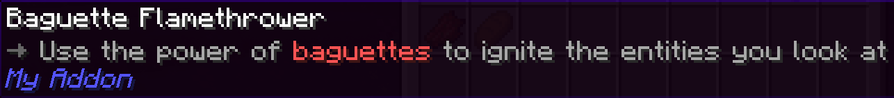
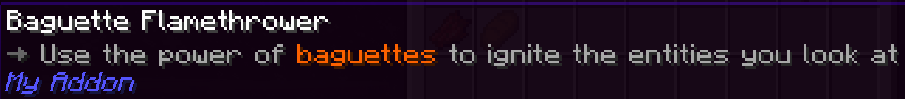
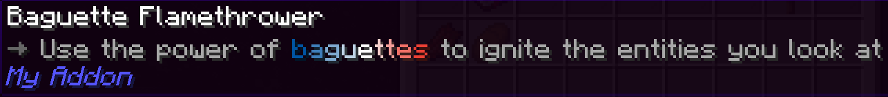

## MiniMessage

物品描述（Lore）可以用 `<arrow>`、`<red>`、`<bold>` 这类**标签**。这些标签来自 [MiniMessage](https://docs.advntr.dev/minimessage/index.html)。

<Callout type="info">
  MiniMessage 标签完整列表在[这里](https://docs.advntr.dev/minimessage/format.html)。
</Callout>

下面是用 MiniMessage 能做出的一些效果示例。

### 简单颜色

```yaml title="en.yml"
baguette_flamethrower:
  name: "Baguette Flamethrower"
  lore: |-
    <arrow> Use the power of <red>baguettes</red> to ignite the entities you look at
```



### 十六进制颜色

```yaml title="en.yml"
baguette_flamethrower:
  name: "Baguette Flamethrower"
  lore: |-
    <arrow> Use the power of <#ff6200>baguettes</#ff6200> to ignite the entities you look at
```



### 渐变

```yaml title="en.yml"
baguette_flamethrower:
  name: "Baguette Flamethrower"
  lore: |-
    <arrow> Use the power of <gradient:#0055a4:white:#ef4135>baguettes</gradient> to ignite the entities you look at
```



### 格式化

```yaml title="en.yml"
baguette_flamethrower:
  name: "Baguette Flamethrower"
  lore: |-
    <arrow> Use the <underlined>power of <bold>baguettes</bold> to ignite</underlined> the entities you look at
```


<Callout type="success" title="最佳实践">
  **别在物品描述和名称里滥用颜色**。正常情况没必要像上面那样把 "baguette" 高亮，没有实际意义。

  虽然很想这么干，但物品多了之后很快就会乱成一团！最好只在**特殊情况**才用颜色和格式（粗体、斜体等）。比如放大镜（Loupe）把 "The examined item will be consumed" 标成红色——因为用放大镜之前知道这一点很重要！
</Callout>

---

## Rebar 的自定义标签

还没完——Rebar 自己也加了一些 MiniMessage 标签！你已经见过 `<arrow>` 了。Rebar 还加了两个非常重要的标签：`<insn>`（指令）和 `<attr>`（属性）。

<Callout type="info">
  Rebar 自定义标签完整列表在[这里](../documentation/reference/language-system/tags.md)。
</Callout>

### 指令 (`<insn>`)

这个标签就是个带颜色的文本简写，用来在视觉上标示一个**操作指令**：

```yaml title="en.yml" hl_lines="5"
baguette_flamethrower:
  name: "Baguette Flamethrower"
  lore: |-
    <arrow> Use the power of baguettes to ignite the entities you look at
    <arrow> <insn>Right click</insn> to ignite the entity you're looking at
```


### 属性 (`<attr>`)

又一个带颜色的文本简写，这次用来标**属性值**：

```yaml title="en.yml" hl_lines="6"
baguette_flamethrower:
  name: "Baguette Flamethrower"
  lore: |-
    <arrow> Use the power of baguettes to ignite the entities you look at
    <arrow> <insn>Right click</insn> to ignite the entity you're looking at
    <arrow> <attr>Burn time:</attr> 2 seconds
```

<Callout type="success" title="最佳实践">
  排序建议：先放描述，再放操作说明，最后放属性值。上面示例就是这样的顺序，有助于保持所有 Rebar 物品的一致性。
</Callout>


"但是等一下！"你可能会问，"我们不是刚加了一个改燃烧时间的配置吗？它不一定是 2 秒啊！"

对，这就是**占位符**派上用场的时候了。

---

## 占位符

有时候需要把代码里的值显示到物品描述上，比如燃烧时间。用占位符就能做到。占位符就是一个标记，比如 `%burn-time%`，意思是「这里会被替换成实际值」。

`RebarItem` 类有个 `getPlaceholders` 方法。实现它之后返回占位符列表，用来替换物品描述里的占位符。给 `BaguetteFlamethrower` 实现一下：

```java title="BaguetteFlamethrower.java" hl_lines="13-18"
public class BaguetteFlamethrower extends RebarItem implements RebarItemEntityInteractor {
    private final int burnTimeTicks = getSettings().getOrThrow("burn-time-ticks", ConfigAdapter.INT);

    public BaguetteFlamethrower(@NotNull ItemStack stack) {
        super(stack);
    }

    @Override
    public void onUsedToRightClickEntity(@NotNull PlayerInteractEntityEvent event, @NotNull EventPriority priority) {
        event.getRightClicked().setFireTicks(burnTimeTicks);
    }

    @Override
    public @NotNull List<RebarArgument> getPlaceholders() {
        return List.of(
                RebarArgument.of("burn-time", burnTimeTicks / 20.0)
        );
    }
}
```

现在可以在物品描述里用这个占位符了。占位符就是你给的字符串两边加上 `%`——本例中就是 `%burn-time%`：

```yaml title="en.yml" hl_lines="6"
baguette_flamethrower:
  name: "Baguette Flamethrower"
  lore: |-
    <arrow> Use the power of baguettes to ignite the entities you look at
    <arrow> <insn>Right click</insn> to ignite the entity you're looking at
    <arrow> <attr>Burn time:</attr> %burn-time% seconds
```


<Callout type="success" title="最佳实践">
  **始终用占位符**，不要把值硬编码到描述里，这样描述中的值永远是对的。
</Callout>

### 单位

上面我们手动写了 "seconds"——但 Rebar 提供了单位 API，能自动选择合适的单位格式。用起来很简单：

```java title="BaguetteFlamethrower.java" hl_lines="16"
public class BaguetteFlamethrower extends RebarItem implements RebarItemEntityInteractor {
    private final int burnTimeTicks = getSettings().getOrThrow("burn-time-ticks", ConfigAdapter.INT);

    public BaguetteFlamethrower(@NotNull ItemStack stack) {
        super(stack);
    }

    @Override
    public void onUsedToRightClickEntity(@NotNull PlayerInteractEntityEvent event, @NotNull EventPriority priority) {
        event.getRightClicked().setFireTicks(burnTimeTicks);
    }

    @Override
    public @NotNull List<RebarArgument> getPlaceholders() {
        return List.of(
                RebarArgument.of("burn-time", UnitFormat.SECONDS.format(burnTimeTicks / 20.0))
        );
    }
}
```

```yaml title="en.yml" hl_lines="6"
baguette_flamethrower:
  name: "Baguette Flamethrower"
  lore: |-
    <arrow> Use the power of baguettes to ignite the entities you look at
    <arrow> <insn>Right click</insn> to ignite the entity you're looking at
    <arrow> <attr>Burn time:</attr> %burn-time%
```


<Callout type="info">
  Rebar 单位完整列表在[这里](https://pylonmc.github.io/rebar/docs/javadoc/io/github/pylonmc/rebar/util/gui/unit/UnitFormat.html)。
</Callout>

<Callout type="success" title="最佳实践">
  **用单位系统代替硬编码单位**。这样相同单位在所有物品里看起来一致，所有值的格式也都统一。
</Callout>
