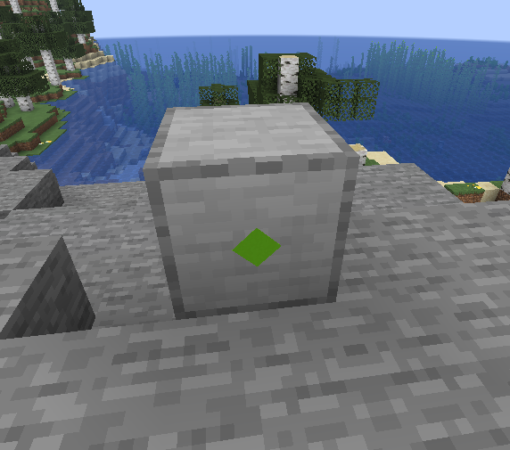

import { Callout } from 'fumadocs-ui/components/callout';
import { LaoWanSays } from '@/components/lao-wan-says';

<Callout>
  **作者：Seggan**
</Callout>

还记得你妈妈告诉过你别把叉子插进插座吗？我插了，结果可不太愉快。

## 电力节点

电力网络的基本单位是电力节点。在最基本的层面上，电力节点就是带有 ID 和它所连接的其他节点 ID 列表的对象。共有四种类型的节点：

### 连接节点（Connector nodes）

这是最基本的类型，除了连接信息外没有其他信息。

### 生产者节点（Producer nodes）

这类节点有一个属性，定义了它们产生多少功率，以瓦特为单位的连续值。

### 消费者节点（Consumer nodes）

这类节点有一个属性，定义它需要多少功率。还有一个只读属性 `isPowered`，只有当消费者获得那么多功率时才为 true（稍后会详细介绍）。

### 接收器节点（Acceptor nodes）

概念上与消费者节点类似，区别在于它们有一个回调，接收给定的功率量而不是请求特定量，并且它们的优先级在消费者之后；也就是说，它们只获得消费者未消耗的剩余功率。这样做既是为了简化路由代码，也是为了允许缓存消费者，从而实现无限速度哈哈哈哈哈哈哈哈哈

<LaoWanSays date="2026-07-04">
  看起来是写电力写疯了，毕竟从4月跳票到了至少7月
</LaoWanSays>

## 电力网络

电力网络就是所有至少与该集合中另一个节点相连的节点的集合。节点之间的每条边可以具有两个属性之一：功率限制和单向性。功率限制限制了通过该边的功率流量，而单向性只允许电力沿一个方向通过该边。

## 网络 Ticking

电力 tick 分为三个部分：消费者 tick、接收器 tick 和生产者 tick。每个 tick，网络首先检查是否存在消费者快照；如果存在，则跳过消费者 tick 直接进入接收器 tick。否则，它首先执行消费者 tick，将结果存储在新的快照中，然后才执行接收器 tick。

### 消费者快照（Consumer snapshots）

这是电力 tick 中提升性能的主要部分。由于生产者和消费者指定的是*功率*（瓦特）而不是*能量*（焦耳），电力可以建模为流动而非离散单位。因此，假设生产和消耗不变，流量计算的结果可以被缓存，直到输入*确实*发生变化，从而大幅提升性能。

一些生产者，比如电容器，会频繁改变其产量。因此，为了不让每次它们改变时都使快照失效，快照还存储了一组未被使用的生产者。如果一个生产者在这个集合中，它可以被更新而不会使快照失效，因为它的更新不会影响任何东西。还有一种边缘情况是当存在未供电的消费者时也会发生这种情况，所以快照还存储了是否有任何消费者未供电。如果是这样，那么多余的能量可能为它供电，因此快照会失效。

然而，这对接收器不适用——由于接收器接收离散量的电力，对其进行黑箱操作（这是关键点），然后输出离散量，结果无法被缓存，因为它们可能随时改变。因此，无论快照状态如何，接收器 tick 始终运行。由于大多数电力机器被建模为消费者而非接收器[[*需要引证*](https://xkcd.com/285/)]，快照系统应该仍然能大幅提升性能。

### 寻路（Pathfinding）

为了将功率从生产者分配给消费者，代码使用贪婪最佳优先搜索。网络维护一个启发式地图，它根据每个节点到给定消费者的距离（需要经过网络中的多少条边）来分配一个数字。由于这个启发式是完美的（即它始终给出到目标的确切距离），贪婪最佳优先搜索在搜索时总是先走数字较小的路径，并且除了单向性或达到功率限制的情况外，总能找到最优路径而不探索任何额外节点。

### 消费者 Tick

1. 将所有需要能量大于 0 的消费者设置为未供电。
2. 先按优先级对生产者排序，再按功率产量降序排序。
3. 从需要功率最少的消费者开始，依次处理：
    1. 对于每个生产者（按步骤 2 排序）：
        1. 从生产者到消费者进行寻路。如果从该生产者到该消费者没有路径，或者生产者的剩余功率为 0，则转到下一个生产者。如果没有任何生产者能到达该消费者，则放弃尝试，转到下一个消费者。
        2. 使用边的限制和边的负载（网络中已经流动的功率），确定实际可以从生产者传输到消费者的功率量。
        3. 用输送的功率更新边的负载。如果任何边达到了限制，暂时断开它们，使寻路不会看到它们。
        4. 如果消费者仍未满足，继续处理下一个生产者，否则将其设置为已供电并继续处理下一个消费者。
4. 用剩余功率、边的负载、断开的边、剩余生产者和是否有消费者未供电来更新消费者快照。

### 接收器 Tick

概念上与消费者 tick 类似：

1. 从快照中获取剩余功率、边的负载和断开的边。
2. 对于每个接收器：
    1. 从剩余功率中为该接收器分配等量的能量。
    2. 对于每个可用的生产者：
        1. 从生产者到接收器进行寻路。如果从该生产者到该接收器没有路径，或者生产者的剩余功率为 0，则转到下一个生产者。如果没有任何生产者能到达该接收器，则放弃尝试，转到下一个接收器。
        2. 使用边的限制和边的负载，确定实际可以从生产者传输到接收器的功率量。
        3. 用输送的功率更新边的负载。如果任何边达到了限制，暂时断开它们，使寻路不会看到它们。
        4. 调用接收器的回调，传入输送的功率。
        5. 如果接收器仍有剩余分配能量，继续处理下一个生产者。否则继续处理下一个接收器。

### 生产者 Tick

这只是通知生产者该 tick 消耗了多少能量。

## 电力方块（Electric blocks）

你可能注意到了这篇文章里可疑地缺少了 Minecraft 相关的术语，比如"方块"、"物品"和"锈蚀的雕纹切制铜楼梯"。这是因为电力方块与电力网络是完全分离的。主要原因是电力方块可以（而且经常）持有多个电力节点。电力方块的工作是双重的：持有节点和持有端口。你问什么是端口？它是电力节点的物理表现形式。截至撰写本文时，它由一个旋转 45 度的正方形表示，就像这样（消费者节点）：

端口还有秘密的交互实体，允许你将电线连接到它们。

### `SimpleElectricRebarBlock`

请允许我引用 Javadoc：

> 在 SimpleElectricRebarBlock 中，创建的所有电力节点都相互连接。这允许将"节点"的概念抽象为通用的"电力方块"，它可以拥有任意数量的连接器、生产者和消费者，而无需担心完整的交互，同时还提供了与电力系统交互的简单实用方法。

每个节点按其类型从 0 开始连续命名。例如，如果你创建两个生产者节点和一个消费者节点，它们将分别被命名为"producer_0"、"producer_1"和"consumer_0"。所有交互方法/属性只会与每种类型的第零个节点交互，所以在这个例子中，是"producer_0"和"consumer_0"节点。由于方块中的所有节点都是互连的，这意味着"producer_1"节点本身不产生功率，但它允许功率从"producer_0"流入自身，从而也能为其他方块供电。
