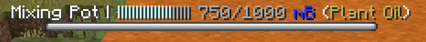
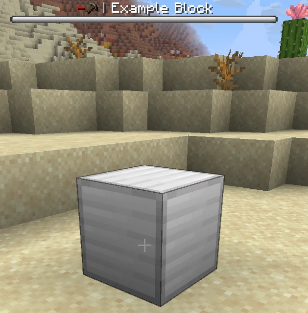
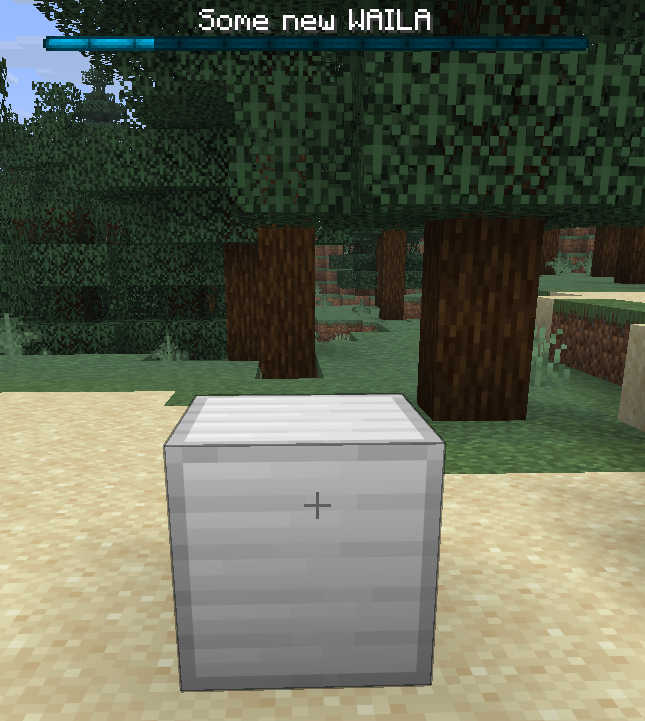

# WAILA

WAILA（What Am I Looking At）可以让你在注视方块时显示相关信息：



默认情况下，方块在 WAILA 中只显示名称（如果方块有指定工具，还会显示工具和工具状态）：




## 自定义 WAILA 显示

你可以覆写 `getWaila` 方法来自定义 WAILA 的各项属性，返回自定义的 [WailaDisplay](https://pylonmc.github.io/rebar/docs/javadoc/io/github/pylonmc/rebar/waila/WailaDisplay.html)。也可以返回 `null` 来隐藏 WAILA。

```java title="ExampleBlock.java"
public class ExampleBlock extends RebarBlock {

    ...

    @Override
    public @Nullable WailaDisplay getWaila(@NotNull Player player) {
        return WailaDisplay.of(this, player);
    }
}
```

玩家注视你的方块期间，`getWaila` 会被持续调用以更新 WAILA 显示。

---

### 添加分段到 WAILA

默认的 WAILA 格式是用竖线分隔多个"分段"（segment），每个分段展示机器的不同信息。你可以调用 WailaDisplay 的 `add` 方法来添加新分段。

绝大多数方块只需要添加新分段就够了，不需要进一步自定义。

#### 示例 1：在 WAILA 中显示天气

```java title="ExampleBlock.java"
public class ExampleBlock extends RebarBlock {

    ...

    @Override
    public @Nullable WailaDisplay getWaila(@NotNull Player player) {
        boolean isSunny = getBlock().getWorld().isClearWeather();
        return WailaDisplay.of(this, player)
                .add(Component.translatable("pylon.item.example_block." + (isSunny ? "sunny" : "raining")));
    }
}
```

```yaml title="en.yml"
item:
  example_block:
    name: "Example Block"
    sunny: "<gold>晴天"
    raining: "<blue>雨天"
```

#### 示例 2：在 WAILA 中显示流体罐内容

```java title="ExampleBlock.java"
public class ExampleBlock extends RebarBlock implements FluidTankRebarBlock {

    ...

    @Override
    public @Nullable WailaDisplay getWaila(@NotNull Player player) {
        return WailaDisplay.of(this, player)
                .add(ProgressBar.fluidContents(getFluidType(), getFluidCapacity(), getFluidAmount()));
    }
}
```

---

### 修改 BossBar 样式

如果你需要，可以修改 BossBar 的颜色、覆盖样式（外观）和进度值。注意这只对使用 BossBar 类型 WAILA 的玩家生效，所以不要用 BossBar 来传递关键信息。

```java title="ExampleBlock.java"
public class ExampleBlock extends RebarBlock {

    ...

    @Override
    public @Nullable WailaDisplay getWaila(@NotNull Player player) {
        // 使用接受方块和玩家参数的 .of 方法获取默认 WAILA
        return WailaDisplay.of(this, player)
                // ……然后按需自定义
                .color(BossBar.Color.BLUE)
                .overlay(BossBar.Overlay.NOTCHED_12)
                .progress(0.8F);
    }
}
```



---

### 完全自定义 WAILA

你可以直接将一个 Component 传给 `WailaDisplay.of(...)` 来完全自定义 WAILA 文本。

```java title="ExampleBlock.java"
public class ExampleBlock extends RebarBlock {

    ...

    @Override
    public @Nullable WailaDisplay getWaila(@NotNull Player player) {
        return WailaDisplay.of(Component.translatable("pylon.item.example_block.custom_waila"));
    }
}
```

### WAILA 覆写

TODO
