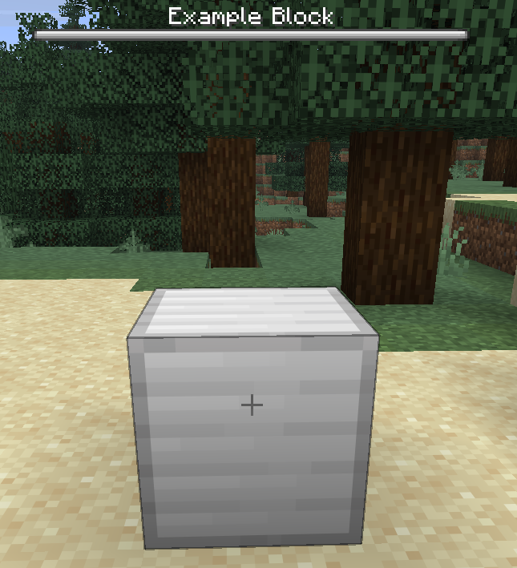
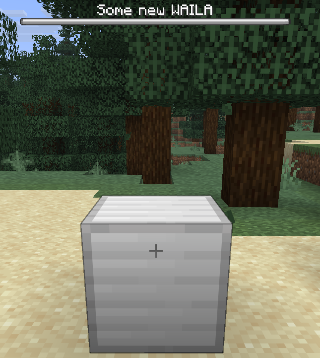
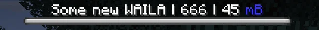

# WAILA

WAILA（What Am I Looking At）可以让你在注视方块时显示相关信息：


默认情况下，方块在 WAILA 中只显示名称：




## 设置自定义 WAILA 文本

你可以在 `en.yml` 里添加 `waila` 字段来自定义 WAILA 文本：

```yaml title="en.yml"
item:
  example_block:
    name: "Example Block"
    lore: |-
      <arrow> An example block
    waila: "Some new WAILA"
```




## 覆盖 `getWaila`

你可以覆写 `getWaila` 方法来自定义 WAILA 的各项属性：
```java title="ExampleBlock.java"
public class ExampleBlock extends RebarBlock {

    ...

    @Override
    public @Nullable WailaDisplay getWaila(@NotNull Player player) {
        return new WailaDisplay(
                getDefaultWailaTranslationKey(), // 文本（用默认文本的话，相当于不覆写 `getWaila`）
                BossBar.Color.BLUE, // 颜色
                BossBar.Overlay.NOTCHED_12, // 样式
                0.2F // 进度
        );
    }
}
```


## 占位符

和物品一样，你也可以给 WAILA 文本添加 `RebarArgument` 形式的占位符：

```java title="ExampleBlock.java"
public class ExampleBlock extends RebarBlock {

    ...

    @Override
    public @Nullable WailaDisplay getWaila(@NotNull Player player) {
        return new WailaDisplay(
                getDefaultWailaTranslationKey().arguments(
                        RebarArgument.of("something", 666),
                        RebarArgument.of("another-thing", UnitFormat.MILLIBUCKETS.format(45))
                )
        );
    }
}
```

```yaml title="en.yml"
item:
  example_block:
    name: "Example Block"
    lore: |-
      <arrow> An example block
    waila: "Some new WAILA | %something% | %another-thing%"
```

