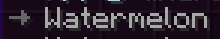
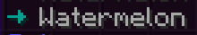
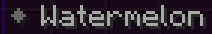
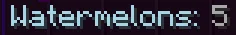
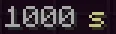
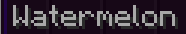
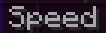
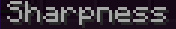
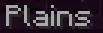

import { Callout } from 'fumadocs-ui/components/callout';

Rebar 的语言文件使用 [MiniMessage](https://docs.advntr.dev/minimessage/index.html) 格式。MiniMessage 自带不少标签，Rebar 在此基础上又加了新的。

<Callout type="info">
  标签的详细用法见[教程 3](../../../create-addons/tutorial-3)。
</Callout>

## Rebar 添加的标签列表

| 标签 | 说明 | 示例 | 示例效果 |
| :-- | :---------- | :------ | :----- |
| `<arrow>` `<arrow:[COLOR]>` | 插入一个右箭头 (→)，可指定颜色（默认：0x666666） | `<arrow> Watermelon` |  |
| `<guidearrow>` | `<arrow:0x3a293>` 的简写；用于 Rebar 指南 | `<guidearrow> Watermelon` |  |
| `<diamond>` `<diamond:[COLOR]>` | 插入一个菱形 (◆)，可指定颜色（默认：0x666666） | `<diamond> Watermelon` |  |
| `<star>` `<star:[COLOR]>` | 插入一个星形 (★)，可指定颜色（默认：NamedTextColor.BLUE） | `<star> Watermelon` |  |
| `<insn></insn>` | 应用黄色样式 (0xf9d104)，用于指令 | `<insn>Right click</insn>` |  |
| `<guideinsn></guideinsn>` | 应用紫色样式 (0xc907f4)，用于指南中的指令 | `<guideinsn>Right click</guideinsn>` |  |
| `<attr></attr>` | 应用青色样式 (0xa9d9e8)，用于属性 | `<attr>Watermelons:</attr> 5` |  |
| `<unit:[unit]></unit>` `<unit:[prefix]:[unit]></unit>` | 将数字格式化为单位，可带可选公制前缀 | `<unit:seconds>1000</unit>` |  |
| `<nbsp></nbsp>` | 将空格替换为不间断空格，防止换行 | `<nbsp>Watermelon</nbsp>` |  |
| `<item:[item_name]>` | 渲染原版或 Rebar 物品的翻译名称 | `<item:pylon:bandage>` |  |
| `<entity:[entity_type]>` | 渲染实体类型的翻译名称 | `<entity:creeper>` |  |
| `<effect:[effect_type]>` | 渲染药水效果的翻译名称 | `<effect:speed>` |  |
| `<enchant:[enchant_name]>` | 渲染附魔的翻译名称 | `<enchant:sharpness>` |  |
| `<biome:[biome_name]>` | 渲染生物群系的翻译名称 | `<biome:plains>` |  |
