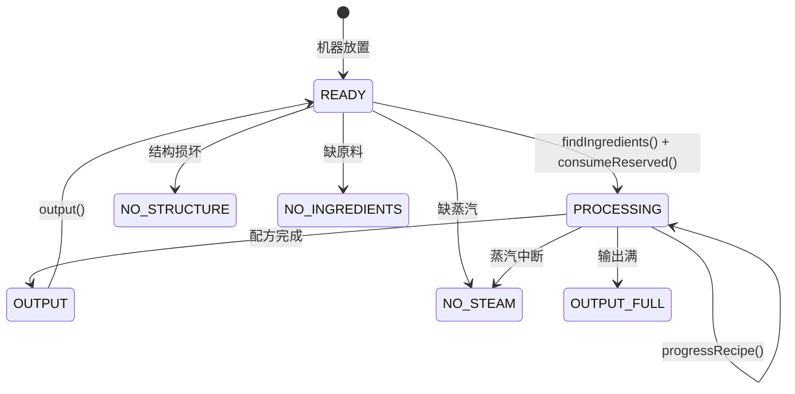

import { Callout } from 'fumadocs-ui/components/callout';

<Callout type="info">
  Steamwork 提供了丰富的**抽象基类和接口**，允许开发者基于其框架创建自定义锅炉、加工机器、涡轮、汽动网络组件和产线成员。本文档涵盖了 Steamwork 的核心 API 设计模式。
</Callout>

## 🧑‍💻 快速开始

### 添加依赖

将 Steamwork 添加到你的 `build.gradle.kts` 中：

```kotlin
dependencies {
    compileOnly("io.github.steamwork:steamwork:0.4.3")
}
```

## 🔥 AbstractSteamBoiler — 锅炉基类

所有锅炉的抽象基类，定义了水→蒸汽转换的核心机制。

### 类签名

```java
public abstract class AbstractSteamBoiler extends RebarBlock
        implements TickingRebarBlock, FluidBufferRebarBlock, WailaRebarBlock { ... }
```

### 核心机制

#### 1. 热源检测

锅炉自动检测下方的热源类型：

```java
// 内部热源检测逻辑（简化）
private boolean hasHeatSource() {
    Block below = getBlock().getRelative(BlockFace.DOWN);
    Material type = below.getType();
    return type == Material.CAMPFIRE          // 营火
        || type == Material.LAVA              // 熔岩
        || type == Material.MAGMA_BLOCK;      // 岩浆块
}
```

#### 2. 启动惩罚（Startup Penalty）

冷启动时锅炉不会立即产汽，需要经过一段加热时间：

```java
// 启动惩罚计数器
private int startupPenaltyTicks; // 冷启动时设为非零值，每tick递减

// 只有 startupPenaltyTicks == 0 时才开始产汽
if (startupPenaltyTicks > 0) {
    startupPenaltyTicks--;
    return; // 尚未就绪
}
```

#### 3. 压力回退（Pressure Backoff）

当蒸汽缓冲区填充度超过 50% 时，产汽速度线性下降：

```java
// 压力回退计算
double bufferFillRatio = (double) currentSteam / maxSteamCapacity;
if (bufferFillRatio > 0.5) {
    // 超过50%后，产汽量按比例衰减
    double backoffFactor = 1.0 - (bufferFillRatio - 0.5) * 2.0; // 0.5→1.0, 1.0→0.0
    steamProduced = (int) (baseProduced * backoffFactor);
}
```

#### 4. 抽象方法

```java
/** 子类实现此方法决定产出的蒸汽流体类型 */
protected abstract Fluid producedSteam();
```

| 子类 | `producedSteam()` 返回值 |
| :--- | :--- |
| `BronzeBoiler` | 蒸汽 (Steam) |
| `InvarBoiler` | 超热蒸汽 (Superheated Steam) |
| `ManganeseSteelBoiler` | 高压蒸汽 (High-Pressure Steam) |
| `TungstenBoiler` | 高压蒸汽 (High-Pressure Steam) |

#### 5. 泄漏机制

当内部压力过高时，锅炉会产生蒸汽泄漏（视觉效果 + 蒸汽流失）。

#### 6. WAILA 显示

锅炉通过 `WailaRebarBlock` 接口提供实时压力信息：

| 压力级别 | 缓冲区占比 | WAILA 显示 |
| :--- | :--- | :--- |
| 低 (Low) | 0% - 33% | 🟢 压力：低 |
| 中 (Medium) | 33% - 66% | 🟡 压力：中 |
| 高 (High) | 66% - 90% | 🟠 压力：高 |
| 排放 (Venting) | 90% - 100% | 🔴 正在排放 |

### 自定义锅炉示例

```java
public class CustomBoiler extends AbstractSteamBoiler {

    public CustomBoiler(Block block, BlockCreateContext context) {
        super(block, context);
        // 设置你的自定义参数
    }

    @Override
    protected Fluid producedSteam() {
        // 返回你自定义的蒸汽流体
        return Registry.STEAM_FLUID; // 或你注册的自定义流体
    }

    @Override
    protected int getSteamPerTick() {
        return 10; // 每 tick 产汽量
    }

    @Override
    protected int getMaxBuffer() {
        return 10000; // 最大缓冲容量
    }
}
```

## ⚙️ AbstractSteamProcessor — 加工机基类

Steamwork 最庞大的基类（~1468 行），所有加工机器的父类。

### 实现的接口

```java
public abstract class AbstractSteamProcessor extends RebarBlock
        implements DirectionalRebarBlock,      // 方向性
                FluidBufferRebarBlock,         // 流体缓冲
                GuiRebarBlock,                 // GUI 界面
                LogisticRebarBlock,            // 物流交互（漏斗/容器）
                TickingRebarBlock,             // 每tick处理
                VirtualInventoryRebarBlock,    // 虚拟库存
                SteamBoostable,               // 可被涡轮加速
                UpgradeableMachine,           // 支持升级模组
                ProductionLineMember { ... }   // 产线成员
```

### 配方生命周期



### StopReason 枚举

```java
public enum StopReason {
    NO_STRUCTURE,    // 多方块结构不完整
    READY,           // 就绪等待
    NO_INGREDIENTS,  // 缺少原料
    NO_STEAM,        // 缺少蒸汽
    OUTPUT_FULL,     // 输出已满
    MIXED_OUTPUT,    // 输出类型冲突
    PROCESSING       // 正在处理
}
```

### 关键方法说明

#### 配方查找与预留

```java
/**
 * 第一步：查找匹配的配方并预留原料
 * @return 是否找到可用配方
 */
protected boolean findIngredients() {
    // 1. 遍历已注册的配方列表
    // 2. 对每个配方检查 input 槽位是否满足要求
    // 3. 找到后调用 consumeReserved() 预扣原料
    // 4. 返回 true 表示可以开始
}

/**
 * 预扣原料（不从实际槽位移除，仅标记"已占用"）
 */
protected void consumeReserved() {
    // 标记原料为"已预留"状态，防止被其他配方重复消耗
}
```

#### 配方推进

```java
/**
 * 每tick调用：推进当前配方进度
 * @return 当前 StopReason
 */
protected StopReason progressRecipe() {
    // 1. 检查蒸汽是否充足（扣除本tick所需蒸汽）
    // 2. 检查是否有涡轮 boost（增加进度）
    // 3. 增加进度计数器
    // 4. 如果进度 >= 总需求 → 进入 output 阶段
    // 5. 否则返回 PROCESSING
}
```

#### 中断恢复机制

当机器运行过程中缺少原料或蒸汽时，不会立即重置，而是进入**中断宽限期（Grace Period）**：

```java
// 默认 60 tick（约3秒）的中断宽限期
private static final int DEFAULT_GRACE_PERIOD_TICKS = 60;
private int graceTicksRemaining;

// 当缺料或缺蒸汽时：
if (missingIngredientOrSteam) {
    if (graceTicksRemaining > 0) {
        graceTicksRemaining--; // 宽限期内保持进度
        return StopReason.NO_INGREDIENTS; // 或 NO_STEAM
    } else {
        resetRecipe(); // 宽限期结束，重置配方
        return StopReason.READY;
    }
}
```

### Hopper / 容器 I/O

`AbstractSteamProcessor` 通过 `LogisticRebarBlock` 接口实现了标准的漏斗/容器交互：

```java
// 自动输入（上方漏斗/容器 → 机器输入槽）
@Override
public void onLogisticInput(ItemStack item, BlockFace fromFace) {
    // 尝试将 item 放入输入槽
    // 受 AUTO_INPUT 升级模组影响时，可从更多方向接受输入
}

// 自动输出（机器输出槽 → 下方/侧面漏斗/容器）
@Override
public ItemStack onLogisticOutput(BlockFace fromFace) {
    // 从输出槽取出物品
    // 受 AUTO_OUTPUT 升级模组影响时，可向更多方向输出
}
```

### 产线集成

作为 `ProductionLineMember` 的实现：

```java
@Override
public boolean acceptFromLine(ItemStack item) {
    // 接收上游产线成员推送的物品，放入输入缓冲
    return inputBuffer.canAccept(item);
}

@Override
public ItemStack pushToNextInLine() {
    // 将产出推送给下游成员
    return ProductionLineMember.deliverToNextMember(getBlock(), this, outputItem);
}
```

### 废料产出（Scrap）

每次配方完成后可能产生废料：

```java
// 配方完成后
onRecipeComplete() {
    // 正常产出...
    
    // 有概率产生废料
    if (shouldProduceScrap()) {
        ItemStack scrap = generateScrap();
        outputBuffer.add(scrap); // 或放入专门的废料槽
    }
}
```

### 自定义加工机器示例

```java
public class CustomProcessor extends AbstractSteamProcessor {

    public CustomProcessor(Block block, BlockCreateContext context) {
        super(block, context);
    }

    @Override
    public NamespacedKey getMachineType() {
        return NamespacedKey.fromString("mymod:custom_processor");
    }

    @Override
    protected int getProcessingTimeTicks() {
        return 100; // 配方需要 100 tick（5秒）
    }

    @Override
    protected int getSteamConsumptionPerTick() {
        return 5; // 每tick消耗5单位蒸汽
    }

    @Override
    public int upgradeSlotCount() {
        return 3; // 支持3个升级插槽
    }
}
```

## 💨 AbstractSteamBooster — 涡轮基类

涡轮的抽象基类，用于为附近机器提供加速 boost。

### TargetType 目标类型

```java
public enum TargetType {
    VANILLA_FURNACE,        // 原版熔炉/高炉/烟熏炉
    STEAMWORK_BOOSTABLE,    // 实现 SteamBoostable 接口的 Steamwork 机器
    REBAR_PROCESSOR,        // 通用 Rebar 处理器
    REBAR_RECIPE_PROCESSOR  // Rebar 配方处理器
}
```

### 扫描与缓存机制

```java
// 环境哈希缓存 —— 避免每tick重新扫描
private int lastEnvironmentHash = 0;
private List<BoostTarget> cachedTargets = List.of();

void tick() {
    // 1. 计算当前环境哈希（周围方块状态的快照）
    int currentHash = computeEnvironmentHash();
    
    // 2. 只有环境变化时才重新扫描
    if (currentHash != lastEnvironmentHash) {
        cachedTargets = scanForTargets(radius);
        lastEnvironmentHash = currentHash;
    }
    
    // 3. 为缓存的目标准施 boost（上限 MAX_BOOST_STACKS=3）
    for (BoostTarget target : cachedTargets) {
        int stacks = Math.min(target.appliedStacks + 1, MAX_BOOST_STACKS);
        target.machine.applyBoost(stacks);
    }
}
```

### Boost 叠加上限

```java
/** 全局上限：每个方块每 tick 最多接受 3 次 boost */
public static final int MAX_BOOST_STACKS = 3;
```

### 协同乘数（Synergy Multiplier）

当涡轮同时影响多个机器时，存在协同效应——影响的机器越多，单次 boost 的效果越强：

```java
// 伪代码：协同乘数计算
double synergyMultiplier = 1.0 + (targetCount - 1) * SYNERGY_FACTOR;
int effectiveBoost = (int) (baseBoost * synergyMultiplier);
```

### 升级支持

| 升级模组 | 效果 |
| :--- | :--- |
| `ENERGY_SAVE` | 每个 -20% 流体消耗 |
| `RANGE` | 每个 +1 扫描半径 |
| `BOOST` | 每个 +1 boost tick / 操作 |

### 自定义涡轮示例

```java
public class CustomTurbine extends AbstractSteamBooster {

    public CustomTurbine(Block block, BlockCreateContext context) {
        super(block, context);
    }

    @Override
    protected Set<TargetType> getTargetTypes() {
        return Set.of(TargetType.STEAMWORK_BOOSTABLE, TargetType.VANILLA_FURNACE);
    }

    @Override
    protected int getDefaultRadius() {
        return 5; // 默认扫描半径5格
    }

    @Override
    protected Fluid getConsumedFluid() {
        return Registry.CUSTOM_STEAM; // 消耗的自定义流体
    }
}
```

## 🔌 UpgradeableMachine & 升级模组系统

### 接口定义

```java
public interface UpgradeableMachine {
    /** 此机器支持的升级插槽数量 */
    int upgradeSlotCount();

    /** 打开升级配置 GUI */
    void openUpgradeGui(Player player);
}
```

### UpgradeType 枚举

```java
public enum UpgradeType {
    ENERGY_SAVE,     // 节能：减少蒸汽/流体消耗
    AUTO_INPUT,      // 自动输入：从容器自动吸料
    AUTO_OUTPUT,     // 自动输出：向容器自动出料
    BULK,            // 批量：增加处理量
    RANGE,           // 范围增强（涡轮专用）：+扫描半径
    BOOST,           // Boost增强（涡轮专用）：+boost tick
    PYLON_COMPAT,    // Pylon兼容：可执行Pylon配方
    AUTO_PRODUCTION  // 自动生产（产线入口专用）：自动触发手动机器
}
```

### 升级模组互斥规则

```java
// MachineCalibrator 中的校验逻辑
public boolean canAcceptUpgrade(UpgradeType type, int slotIndex) {
    // 示例规则：
    // - ENERGY_SAVE 与 BOOST 不能共存于同一插槽
    // - AUTO_INPUT 与 BULK 可能冲突
    // - PYLON_COMPAT 占用专属插槽
    
    UpgradeType existing = getUpgradeInSlot(slotIndex);
    if (existing != null && isMutuallyExclusive(existing, type)) {
        return false;
    }
    return true;
}
```

### 自定义升级模组

```java
public class SpeedUpgradeModule extends UpgradeModule {

    public SpeedUpgradeModule() {
        super(UpgradeType.BULK); // 复用BULK类型或注册新类型
    }

    @Override
    public void apply(AbstractSteamProcessor machine) {
        // 应用加速效果：减少处理时间
        int speedBonus = getCount() * 20; // 每个模块 -20% 时间
        machine.setSpeedModifier(1.0 - speedBonus * 0.2);
    }
}
```

## 🔄 ProductionLineMember — 产线成员接口

产线系统的核心接口，由入口、出口和参与产线的机器共同实现。

### 接口定义

```java
public interface ProductionLineMember {
    // ===== PDC 持久化键 =====
    NamespacedKey LINE_ID_KEY;          // 产线 UUID
    NamespacedKey LINE_POSITION_KEY;    // 在产线中的序号
    NamespacedKey LINE_DIRECTION_KEY;   // 朝向下一个成员的方向
    NamespacedKey LINE_CREATOR_KEY;     // 激活玩家名
    NamespacedKey LINE_NUMBER_KEY;      // 创建者视角编号

    // ===== 读取 =====
    UUID getLineId();
    int getLinePosition();
    BlockFace getLineDirection();
    String getLineCreator();
    int getLineNumber();
    boolean isInLine();

    // ===== 写入 =====
    void joinLine(UUID lineId, int position, BlockFace direction);
    void setLineCreator(String creator);
    void setLineNumber(int number);
    void leaveLine();

    // ===== 物品推送协议 =====
    boolean acceptFromLine(ItemStack item);
    boolean hasFuelSlot();
    boolean acceptFuelFromLine(ItemStack item);
    void onLineJammed();
    void onLineResumed();

    // ===== 多方块支持 =====
    Set<Block> getOwnedMultiblockComponentBlocks();
}
```

### 物品推送流程

```
上游机器完成产出
    ↓
pushToNextInLine() 调用 deliverToNextMember()
    ↓
deliverToNextMember(source, member, item):
    1. 获取 lineId 和 direction
    2. 沿 direction 方向搜索下游成员（最多 DISBAND_MAX_GAP+1 格）
    3. 找到后逐个调用 next.acceptFromLine(item.asQuantity(1))
    4. 返回未能推送的剩余物品
```

### 工厂方法 — 方块包装

```java
static ProductionLineMember of(Block block) {
    RebarBlock rb = RebarBlock.getRebarBlock(block);
    
    // 1. 直接是 ProductionLineMember 的 Rebar 方块
    if (rb instanceof ProductionLineMember m) return m;
    
    // 2. Pylon 混合釜包装
    if (PylonMixingPotMember.isPylonMixingPot(rb)) 
        return new PylonMixingPotMember(block, mixingPot);
    
    // 3. Pylon 通用机器包装
    if (PylonMachineMember.isPylonMachine(rb)) 
        return new PylonMachineMember(block, rb);
    
    // 4. Steamwork 压机包装
    if (SteamPressMember.isSteamPressBase(block)) 
        return new SteamPressMember(block);
    
    // 5. 原版熔炉包装
    if (VanillaFurnaceMember.isVanillaFurnace(block)) 
        return new VanillaFurnaceMember(block);
    
    // 6. 原版工作台包装
    if (VanillaCrafterMember.isVanillaCrafter(block)) 
        return new VanillaCrafterMember(block);
    
    return null; // 不支持的方块类型
}
```

### 解散扫描算法

当产线中的方块被破坏时，触发解散扫描：

```java
static void disbandScan(Block start, BlockFace dir, UUID lineId,
                        ProductionLineMember firstDissolved) {
    Block cursor = start;
    ProductionLineMember lastDissolved = firstDissolved;
    
    while (true) {
        ProductionLineMember m = of(cursor);
        if (m != null) {
            if (!lineId.equals(m.getLineId())) break; // 不同产线，停止
            lastDissolved = m;
            m.leaveLine(); // 移除产线数据
            cursor = cursor.getRelative(dir);
            continue;
        }
        
        // 跳过多方块附属方块（如钢梁）
        if (lastDissolved.getOwnedMultiblockComponentBlocks().contains(cursor)) {
            cursor = cursor.getRelative(dir);
            continue;
        }
        
        // 前瞻检查前方成员的前置附属方块
        // （最多向前看 DISBAND_MAX_GAP 格）
        if (!peekAheadForMultiblockComponents(cursor, dir, lineId)) break;
    }
}
```

### 自定义产线成员

让你的自定义机器加入产线：

```java
public class CustomMachine extends AbstractSteamProcessor {

    // AbstractSteamProcessor 已经实现了 ProductionLineMember
    // 你只需要确保 acceptFromLine 和 pushToNextInLine 正确工作

    @Override
    public boolean acceptFromLine(ItemStack item) {
        // 将物品放入输入虚拟槽位
        return virtualInventory.getInputHandler().insert(item) == null;
    }

    @Override
    public Set<Block> getOwnedMultiblockComponentBlocks() {
        // 如果你的机器是多方块结构，返回辅助方块集合
        // 这样解散扫描时会正确跳过它们
        return Set.of(
            getBlock().getRelative(BlockFace.UP),    // 顶部辅助方块
            getBlock().getRelative(BlockFace.DOWN)   // 底部辅助方块
        );
    }
}
```

## 🌐 汽动输送网络 API

### PneumaticDuct — 管道

管道是汽动网络的核心连接组件，使用 **ItemDisplay** 实体渲染视觉效果。

#### 核心常量

```java
private static final float SINGLE_SCALE = 0.35F;        // 孤立管道显示大小
private static final double HALF_SEGMENT = 0.5D;         // 普通连接段长度
private static final double ENDPOINT_SEGMENT = 1.0D;     // 端点连接段长度
private static final int MAX_CONNECTIONS = 3;            // 最大连接数
private static final float[] LINE_THICKNESSES = {        // 防Z-fighting厚度
    0.3495F, 0.3490F, 0.3485F
};
```

#### 连接判定

```java
// 双向连接验证 —— 两端必须都同意连接
private boolean canConnectTo(BlockFace face) {
    Block neighbor = getBlock().getRelative(face);
    RebarBlock rb = loadedRebarBlock(neighbor);
    
    return (rb instanceof PneumaticDuct)
        || (rb instanceof PneumaticGateValve && valve.acceptsConnection(face.getOppositeFace()))
        || (rb instanceof SteamCatapult)
        || (rb instanceof PneumaticInput && input.acceptsConnection(face.getOppositeFace()))
        || (rb instanceof PneumaticOutput && output.acceptsConnection(face.getOppositeFace()));
}

// 互惠连接检查
private boolean hasReciprocalConnection(BlockFace face) {
    RebarBlock neighborRB = loadedRebarBlock(getBlock().getRelative(face));
    if (neighborRB instanceof PneumaticDuct duct) {
        return duct.getPreferredConnectableFaces().contains(face.getOppositeFace());
    }
    // 阀门/端点默认接受
    return true;
}
```

#### BFS 网络寻路

```java
/**
 * 从起点 BFS 搜索所有可达的端点（输入/输出/弹射器）
 */
public static List<Block> findReachableEndpoints(Block origin) {
    List<Block> endpoints = new ArrayList<>();
    Set<Block> visited = new HashSet<>();
    Queue<Block> queue = new ArrayDeque<>();
    queue.add(origin);
    visited.add(origin);

    while (!queue.isEmpty()) {
        Block current = queue.poll();
        for (BlockFace face : getTraversalFaces(current)) {
            Block neighbor = current.getRelative(face);
            if (visited.contains(neighbor)) continue;
            visited.add(neighbor);

            RebarBlock rb = loadedRebarBlock(neighbor);
            if (rb instanceof PneumaticDuct) {
                queue.add(neighbor); // 管道：继续搜索
            } else if (rb instanceof PneumaticGateValve valve
                    && valve.acceptsConnection(face.getOppositeFace())) {
                queue.add(neighbor); // 阀门：穿透继续
            } else if (rb instanceof SteamCatapult
                    || rb instanceof PneumaticInput input
                            && input.acceptsConnection(face.getOppositeFace())) {
                endpoints.add(neighbor); // 端点：记录
            }
        }
    }
    return endpoints;
}
```

### 自定义网络组件

创建自定义的汽动网络端点：

```java
public class CustomPneumaticEndpoint extends RebarBlock implements FacadeRebarBlock {

    public CustomPneumaticEndpoint(Block block, BlockCreateContext context) {
        super(block, context);
    }

    /** 接受来自管道的连接 */
    public boolean acceptsPneumaticConnection(BlockFace fromFace) {
        // 你的自定义连接条件
        return fromFace == BlockFace.UP || fromFace == BlockFace.DOWN;
    }

    /** 当相邻管道刷新显示时被调用 */
    public void refreshDisplays() {
        // 更新你的显示实体
    }
}
```

## 🛠️ SteamEquipment — 蒸汽装备系统

### 基类设计

```java
public class SteamEquipment extends RebarItem 
        implements DurabilityRebarItemHandler {

    public SteamEquipment(ItemStack stack) {
        super(stack);
    }

    @Override
    public void onItemDamaged(PlayerItemDamageEvent event, EventPriority priority) {
        event.setCancelled(true);  // 取消原版耐久损失
        event.setDamage(0);
    }
}
```

**关键设计理念**：装备本身**不预置蒸汽容量**——容量由通过「蒸汽装备改装台」安装的 **SteamCanister**（便携蒸汽罐）决定。

### 装备三态模型

| 状态 | 条件 | 属性表现 |
| :--- | :--- | :--- |
| **未装罐** | socket = none | 半成品，属性大幅降低，无蒸汽能力 |
| **装罐·有汽** | 已装罐且蒸汽 > 0 | 满血状态，基础属性 + 蒸汽增益 |
| **装罐·耗尽** | 已装罐但蒸汽 = 0 | 明显降级，失去全部蒸汽增益 |

### SteamCanister 类型

```java
public enum SteamCanisterType {
    SMALL,   // 小型罐：低容量，适合轻型工具
    MEDIUM,  // 中型罐：中等容量，均衡选择
    LARGE    // 大型罐：高容量，适合重型装备
}
```

### 自定义蒸汽装备

```java
public class CustomSteamTool extends SteamEquipment implements SteamToolItem {

    public CustomSteamTool(ItemStack stack) {
        super(stack);
    }

    @Override
    public void onSteamAttack(EntityDamageEvent event, int steamLevel) {
        // steamLevel 0-2 对应小/中/大罐的加成等级
        double bonus = 1.0 + steamLevel * 0.5; // 每级 +50% 伤害
        event.setDamage(event.getDamage() * bonus);
    }

    @Override
    public void onSteamMine(BlockBreakEvent event, int steamLevel) {
        // 挖掘速度加成
        // steamLevel 越高，挖掘越快
    }
}

public class CustomSteamArmor extends SteamEquipment implements SteamArmorItem {

    public CustomSteamArmor(ItemStack stack) {
        super(stack);
    }

    @Override
    public void onSteamDamageReceived(EntityDamageEvent event, int steamLevel) {
        // 减伤加成
        double reduction = steamLevel * 0.1; // 每级 -10% 伤害
        event.setDamage(event.getDamage() * (1.0 - reduction));
    }
}
```

## 📝 最佳实践

### 机器开发

- 继承 `AbstractSteamProcessor` 时，务必正确实现 `getProcessingTimeTicks()` 和 `getSteamConsumptionPerTick()`
- 如果你的机器是多方块结构，记得覆盖 `getOwnedMultiblockComponentBlocks()` 以便产线系统能正确跳过附属方块
- 利用 `StopReason` 枚举来清晰表达机器的各种停机原因
- 配方完成后考虑是否需要废料产出（Scrap）以平衡经济

### 涡轮开发

- 注意 `MAX_BOOST_STACKS = 3` 的全局上限，不要假设可以无限叠加
- 使用环境哈希缓存来优化扫描性能，避免每 tick 全量扫描
- 合理设置默认扫描半径，过大会影响服务器性能

### 汽动网络开发

- 自定义端点必须正确实现 `acceptsPneumaticConnection()` 并处理好双向连接验证
- `findReachableEndpoints()` 使用 BFS 算法，确保你的组件不会导致无限循环
- 管道的 `MAX_CONNECTIONS = 3` 是硬限制，设计网络拓扑时请考虑此约束

### 产线开发

- 产线数据通过 PDC 持久化，服务器重载后会自动恢复
- `DISBAND_MAX_GAP = 3` 意味着多方块的附属方块的间隔不能超过 3 格
- `acceptFromLine()` 应该返回 `boolean` 表示是否成功接收，不要静默失败
- 如果你的机器需要燃料槽（如熔炉类），覆盖 `hasFuelSlot()` 和 `acceptFuelFromLine()`

### 升级模组开发

- 注意升级模组的**互斥规则**，在 `MachineCalibrator` 中注册正确的排斥关系
- `PYLON_COMPAT` 是特殊的升级模组，它让机器能够执行 Pylon 的配方——这是一个强大的桥接功能
- `AUTO_PRODUCTION` 仅适用于产线入口，用于自动触发需要手动操作的机器
